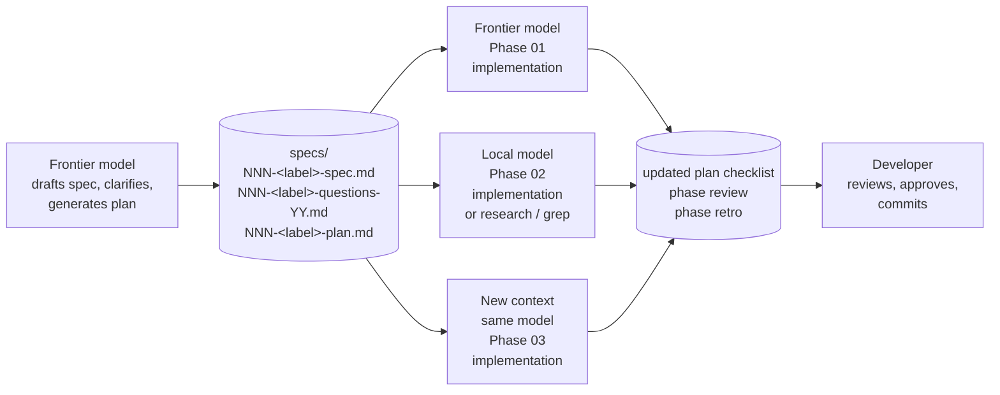
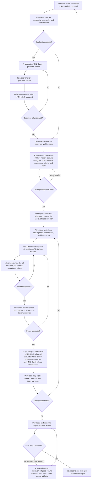

# Human-Gated Spec-Driven AI Development

## Table of Contents

- [Abstract](#abstract)
- [Quick Start](#quick-start)
- [Why This Process Exists](#why-this-process-exists)
- [Designed for Model and Context Handoffs](#designed-for-model-and-context-handoffs)
- [What “Human-Gated” and “Spec-Driven” Each Mean](#what-human-gated-and-spec-driven-each-mean)
- [Advantages of the Process](#advantages-of-the-process)
- [Potential Limitations](#potential-limitations)
- [Who This Is For](#who-this-is-for)
- [Choosing the Right Weight](#choosing-the-right-weight)
- [How This Compares to Other Spec-Driven Approaches](#how-this-compares-to-other-spec-driven-approaches)
- [Process Flow](#process-flow)
- [The Workflow in Detail](#the-workflow-in-detail)
- [Recommended Artifact Conventions](#recommended-artifact-conventions)
- [Compact Worked Example](#compact-worked-example)
- [What This Process Does Not Solve](#what-this-process-does-not-solve)
- [How to Measure Whether It Helps](#how-to-measure-whether-it-helps)
- [Selected Supporting References](#selected-supporting-references)
- [Conclusion](#conclusion)
- [Supporting Skill](#supporting-skill)

## Abstract

**Human-Gated Spec-Driven AI Development** is a way to use AI for real software work that produces durable, portable artifacts instead of chat-resident state. The spec, the clarification questions, the plan, and the plan's current checklist state all live in named markdown files in `specs/`. That choice is the whole point: it lets your project state survive token exhaustion, context resets, and handoffs between models — including handoffs between a frontier model planning the work and a local model executing parts of it.

Modern agents plan well *within* a session. This methodology is about what happens *between* sessions, between models, and between humans.

The workflow keeps the spec as the source of truth and the developer in charge of approval at four points: the working spec, the phased plan, each completed phase, and the final implementation. The AI prepares work for review; the human owns commits, pull requests, and delivery.

The payoff is operational: less scope drift, clearer review points, better handoffs between sessions and models, and fewer moments where fast AI output outruns human understanding.

> **When this is overkill:** For tiny bug fixes, one-off scripts, or throwaway prototypes, this process is more discipline than the work needs. See [Choosing the Right Weight](#choosing-the-right-weight) for a lighter version. The full workflow is built for work that has to survive context resets, model swaps, or review by someone other than the original author.

---

## Quick Start

If you want the shortest usable version of this workflow, do this:

1. The developer writes a short spec in `specs/NNN-<label>-spec.md`.
2. The AI reviews the spec for ambiguity, missing constraints, and risky assumptions.
3. If clarification is needed, the AI captures unresolved questions in `specs/NNN-<label>-questions-YY.md`, and the developer answers them.
4. The AI folds those answers back into the spec and either leaves that questions set as a resolved historical artifact or creates the next numbered questions set with only the remaining unresolved items.
5. Steps 3 and 4 repeat until the spec is clear enough to plan.
6. When the spec is ready, the developer reviews and approves the working spec.
7. The AI generates a phased plan in `specs/NNN-<label>-plan.md`, and the developer reviews it, either requesting revisions or approving it.
8. Once the spec and plan are approved, the developer should strongly consider creating a checkpoint commit before implementation begins.
9. The AI implements one phase only, runs the full test suite, and updates the plan and related artifacts before the developer reviews the result.
10. When a phase is approved, the AI updates `specs/NNN-<label>-phase-NN-review.md` and `specs/NNN-<label>-phase-NN-retro.md`, and the developer should strongly consider creating another checkpoint commit before beginning the next phase.
11. After the last phase, the developer performs a final implementation review and can either request improvements or approve completion.

The label is optional; the three-digit numeric prefix is what groups artifacts in one cycle. When this README shows a filename, it uses the labeled form so the workstream is recognizable at a glance.

In one sentence: the spec stays primary, the human stays in charge, and the AI only moves through explicit gates.

---

## Why This Process Exists

AI tools can accelerate software work dramatically, but unstructured usage creates predictable problems:

- implementation starts before requirements are clear
- the model silently makes architectural choices that nobody approved
- generated code drifts beyond the intended scope
- code quality varies across sessions because there is no shared baseline
- context windows fill up and continuity is lost mid-feature
- a swap to a different model means starting over, because state lived in chat
- a long-running agent's hallucinations get committed because nothing forces a fresh, file-grounded check
- rationale for past decisions disappears with the session that produced it
- review becomes reactive instead of designed into the workflow
- run out of tokens on a given model and need to wait for hours or switch to a different model

In practice, the biggest challenge is not getting AI to write code. The biggest challenge is creating a process that keeps humans in charge of requirements, sequencing, boundaries, and approval — and that keeps project state portable enough to survive a context reset, a model swap, or a handoff to a different agent — while still benefiting from AI speed.

Human-Gated Spec-Driven AI Development addresses that problem directly.

---

## Designed for Model and Context Handoffs

The single most important design choice in this workflow is that **project state lives in files, not in chat**. The spec, the clarification questions, the plan, and the plan's checklist state are all durable markdown files under `specs/`. Once you accept that constraint, several practical scenarios become possible that chat-based AI workflows do not support:

- **Resume across sessions.** A new context — same model, fresh window — picks up the work by reading the spec and plan and checking the current checklist state. There is no need to reconstruct intent from previous conversation.
- **Swap models between phases.** A model better suited to a specific phase (longer context, stronger reasoning, faster, cheaper) can take over because it has the same files to read.
- **Recover from degraded long-context behavior.** When a long-running session starts hallucinating or losing track, a fresh context picks up where the artifacts say the work stands, not where the chat history suggests it does.
- **Mix models — including local ones — across phases.** Because the spec and plan are durable files, you can route different phases to different models. A natural split is to use stronger models for spec drafting, clarification, and plan generation, and lighter or local models for bounded implementation phases or codebase reconnaissance where the quality ceiling is acceptable and the privacy, cost, or speed wins matter. This is a possibility the file-based artifacts keep open rather than a workflow the author runs every day; gentle-pi — one of the alternatives covered in [How This Compares to Other Spec-Driven Approaches](#how-this-compares-to-other-spec-driven-approaches) — has the same property through Pi's per-agent model routing. The point is that durable artifacts make this kind of split practical regardless of which agent or hosting setup you use.

A schematic handoff:



Modern Claude, Codex, and Antigravity ship capable planning modes that ask clarifying questions and structure work before implementation. They plan well *within* a session. But unless explicitly prompted, they leave their plans and clarifications in chat state that does not survive the session, cannot be cited from another agent, and cannot be handed to a second model. That is the gap this methodology fills: persistence and portability of planning state, not planning quality itself.

---

## What “Human-Gated” and “Spec-Driven” Each Mean

**Human-gated** means the AI is a collaborator, not an autonomous engineer. The workflow expects explicit developer approval at four points: the working spec, the phased plan, each completed phase, and final completion or release. The developer also owns the repository actions outside the AI's authority — code review decisions, commits and branch history, pull requests, and GitHub review handling. The AI prepares work for review; the human remains the delivery authority.

Without gates, AI can move quickly in the wrong direction. With gates, speed becomes more trustworthy.

**Spec-driven** means the spec is the control plane, not retroactive explanation for whatever was implemented. Planning, implementation, review, testing, and revision all anchor back to the spec. When the spec changes, downstream artifacts can change with it; what stays constant is that the project remains tied to explicit intent rather than drifting through chat history.

Together, the two ideas keep responsibility with the developer and keep project state legible: a clear thing to approve, a clear authority approving it, and a paper trail that survives the session that produced it.

---

## Advantages of the Process

### Better Quality Control

Review gates and acceptance criteria reduce the chance that AI-generated code is merged simply because it “looks plausible.”

### Better Use of AI

The process uses AI where it is strongest:

- finding ambiguity
- drafting structured artifacts
- generating candidate plans
- implementing bounded tasks
- performing structured reviews

### Better Continuity Across Sessions

Chat-based workflows break down when tokens run out or context becomes compressed. Durable markdown artifacts solve this problem by moving project state into files instead of relying on chat memory.

### Easier Handoffs

A new agent or a new session can resume from the spec artifacts rather than reconstructing intent from conversation history.

### Less Rework

Clarifying the spec before coding usually reduces mid-stream corrections.

---

## Potential Limitations

This workflow is not free.

It introduces structure, which means it can feel slower for trivial tasks. For very small changes, a lighter version of the process may be enough.

Possible downsides include:

- more up-front writing
- more artifact maintenance
- temptation to over-formalize small work
- review overhead if phases are too tiny

The solution is not to abandon the workflow. The solution is to right-size it.

For a small task, the lightweight version might be:

- developer writes a short spec
- AI performs a quick critique
- AI drafts a 2 to 4 step plan
- AI implements step 1 only
- developer reviews and decides whether to continue

Even in the lightweight version, the same principles still apply: clarify intent before coding, keep scope bounded, and require evidence before calling work complete.

---

## Who This Is For

This workflow is most useful for:

- solo developers who want more discipline when using AI
- teams that need clearer review gates and handoff artifacts
- projects where correctness, traceability, or architectural control matter

It is less necessary for one-off throwaway scripts or tiny low-risk changes.

---

## Choosing the Right Weight

Not every task needs the full version of the process.

| Situation | Recommended Process |
| --- | --- |
| Tiny bug fix or copy update | developer writes a short spec, AI critiques it, AI drafts a short plan, AI implements |
| Medium feature or refactor | developer writes the spec, AI reviews and questions it, AI iterates on clarification until the spec is ready, AI drafts a phased plan, developer gates implementation |
| High-risk or multi-session work | full workflow with numbered artifacts, developer approvals, and AI-maintained review and retrospective artifacts |

---

## How This Compares to Other Spec-Driven Approaches

Several other methodologies cover similar ground. The high-level arc — spec, plan, phased implementation, markdown artifacts — is shared. The differences are deliberate trade-offs.

| Aspect | GitHub Spec Kit | OpenSpec | gentle-pi | This workflow |
| --- | --- | --- | --- | --- |
| Surface | Slash commands + templates in 30+ agents | CLI + slash commands in 25+ agents | Pi runtime only (explicitly non-portable) | Plain markdown files in `specs/` |
| Phases | Spec → Plan → Tasks → Implement | Proposal → Design → Tasks → Spec deltas | 10 phases: init → explore → proposal → spec → design → tasks → apply → verify → sync → archive | 4 gates: spec → plan → each phase → final |
| Clarification | Chat or slash commands | Inline in proposal/design | Chat by default; file fallback inside `proposal.md` | Durable numbered `NNN-<label>-questions-YY.md` with `> Decision:` / `> Question:` |
| Spec evolution | Edits to the spec file | **Formal deltas** (ADDED / MODIFIED / REMOVED, RFC 2119, Given/When/Then) | Inherits OpenSpec deltas + archives to immutable timestamped folders | Free-form edits + numbered questions history |
| Per-agent model routing | Not explicit | Not explicit | First-class via `/gentle:models` | Implicit — point a different agent or model at the same files |
| Design goal | Structured context for your agent | Lightweight, brownfield-first, specs as living docs | Controlled coding harness over Pi | Project state that survives model and context handoffs |

A few honest notes on positioning:

- **gentle-pi reaches similar conclusions about artifact-centric work.** Its "Artifacts over floating chat context" framing is close to the design goal of this workflow. The two main differences are that gentle-pi is Pi-only by design (the orchestrator explicitly says *"Do not claim portability outside the Pi runtime"*), and that gentle-pi's clarification defaults to chat with a file-based fallback rather than a durable numbered artifact.
- **OpenSpec's spec deltas are a real engineering contribution this workflow does not match.** ADDED / MODIFIED / REMOVED requirement operations with RFC 2119 keywords and Given/When/Then scenarios are more rigorous than free-form spec edits. The numbered questions history in this workflow captures *why* the spec evolved, not *what* changed structurally. The two ideas are complementary.
- **Spec Kit is the mainstream baseline.** If you want the most polished, broadly supported slash-command experience inside a single agent, Spec Kit is the right choice. This workflow is for cases where artifact portability across sessions, models, and agents matters more than slash-command polish.

A rough decision guide:

| If you want… | Choose |
| --- | --- |
| Mainstream, polished, slash-command-driven SDD inside one agent | Spec Kit |
| Formal requirement evolution and diffable specs | OpenSpec |
| A controlled harness with per-agent model routing and strict TDD, on top of Pi | gentle-pi |
| Plain-file portability across sessions, models, and agents, with a durable clarification artifact | This workflow |

None of these are mutually exclusive. Spec Kit's templates work alongside this workflow's questions convention. OpenSpec's delta format can be adopted on top of any of them. gentle-pi inherits OpenSpec's delta semantics for free.

For a deeper comparison — including each methodology's strengths, blind spots, and what each could borrow from the others — see [`comparison.md`](./comparison.md).

---

## Process Flow



---

## The Workflow in Detail

### 1. Draft the Initial Spec

The process starts with a written spec prepared by the developer, saved as `specs/NNN-<label>-spec.md`. It does not need to be perfect, but it does need to state enough intent to anchor the rest of the work.

A useful spec usually includes:

- objective
- problem statement
- users or stakeholders
- functional requirements
- non-functional requirements
- constraints
- non-goals
- risks
- acceptance criteria

The spec does not need to solve every detail up front. It needs to make the intended outcome legible.

### 2. Review the Spec Before Planning

The AI should not jump directly from vague requirements to code. Instead, it should first review the spec for:

- ambiguity
- contradiction
- missing constraints
- unspoken assumptions
- edge cases
- likely implementation traps

This shifts the conversation from “write code” to “clarify intent.”

### 3. Capture Open Questions in `NNN-<label>-questions-YY.md`

Inline clarification in chat often becomes noisy and hard to reuse. A better pattern is for the AI to create a numbered markdown artifact such as `specs/NNN-<label>-questions-01.md`.

That file captures:

- unanswered questions
- assumptions to confirm
- unresolved tradeoffs
- edge-case prompts
- missing acceptance criteria

The developer answers the file directly. The AI then folds those answers back into the spec. If all important clarification is complete, that numbered questions file stays behind as a historical record of that clarification pass. If important questions remain, the AI creates the next numbered questions file so it contains only the still-unresolved questions. That clarification loop repeats until the spec is ready to plan.

When answering a questions artifact, blockquoted labels are a useful lightweight convention for comments and feedback:

```md
> Decision:
> The decision made was...

> Question:
> I have a question...
```

Use `Decision` for settled answers the AI should fold into the spec. Use `Question` for follow-up uncertainty the AI should preserve or turn into a cleaner unresolved question.

Using the same numeric prefix as the related spec and plan reduces the chance of collisions when multiple workstreams are active at the same time. An optional label can make it easier for developers to recognize the workstream at a glance, as long as the same `NNN` and label are used consistently across related artifacts. Use a two-digit question-set tracker such as `01`, `02`, `03` so each clarification pass has a stable filename and prior comments are preserved.

### 4. Freeze a Working Spec

Once the important ambiguities are resolved and the developer is satisfied with the result, the team has a **working spec**. It is not necessarily final for all time, but it is stable enough to plan against.

This matters because planning against an unstable spec produces unstable implementation.

This is not waterfall. The spec is stable enough to plan against, not immutable. The process expects revision when new information appears, but it makes those revisions explicit instead of accidental.

This is also a developer gate. Before planning begins, the developer should explicitly approve the working spec.

### 5. Generate a Phased Plan

After the developer approves the working spec, the AI should generate a plan that breaks work into small, reviewable phases. Each phase should have:

- a clear goal
- a task checklist
- scope boundaries
- acceptance criteria
- risks or blockers
- out-of-scope notes

A practical plan format is a markdown document at `specs/NNN-<label>-plan.md`, where each phase is a section header and each task is tracked with checklist markers:

- `[ ]` not started
- `[-]` in progress
- `[x]` completed
- `[!]` blocked

This makes the plan handoff-friendly and session-friendly.

### 6. Approve the Plan Before Implementation

The developer reviews the phased plan before code is generated. This is a key developer gate.

The review can:

- reorder phases
- split large phases
- tighten acceptance criteria
- reduce risk earlier
- remove speculative work

If the plan is not acceptable yet, the AI should revise it and return to the same approval gate before implementation starts.

This is where the developer prevents the AI from optimizing a poor sequence.

Once the working spec and phased plan are both approved, that is a strong checkpoint for a commit. If implementation later drifts or fails badly, the developer has a clean rollback point and the AI can attempt the implementation again from a known-good baseline.

### 7. Implement One Phase Only

The AI then works on **one phase at a time**.

Before implementation, the AI should restate:

- the phase goal
- assumptions in force
- what “done” means
- what is explicitly out of scope

This simple restatement often prevents scope creep.

For implementation, a strong default is **red/green TDD** where feasible:

1. write or identify the failing test
2. make the smallest change to pass
3. refactor while preserving behavior
4. ensure compilation and test success

The AI should not silently implement later phases “while it is there.”

During implementation, the plan should be kept current. As work progresses, the AI should update checklist items to show what is in progress, what is completed, and what is blocked. If something is blocked, the plan should say why so the developer can review the actual project state rather than a stale snapshot.

### 8. Validate Before Declaring Completion

Phase completion should require evidence, not confidence.

That normally means the AI performs the checks and the developer reviews the evidence:

- the code compiles or builds
- targeted tests pass during iteration
- the full project test suite passes before the phase is declared complete
- acceptance criteria are checked
- scope boundaries were respected

If the phase fails those checks, the AI loops back into implementation rather than moving forward. A phase is not done until validation passes and the developer approves it.

### 9. Review the Phase

The developer should review each completed phase against:

- correctness
- acceptance criteria
- maintainability
- readability
- architectural fit
- design principles

A useful review lens includes:

- **SOLID**
- **DRY**
- **YAGNI**
- **KISS**
- separation of concerns
- coupling and cohesion
- testability

The goal of the review is not to nitpick. It is to keep code health from degrading one phase at a time.

If helpful, the developer can also ask the AI to assist with a more formal phase review. In the supporting skill, that optional helper stage is `review-phase`. It does not replace the developer's review authority. It adds a structured second pass and can record findings in a review artifact.

### 10. Record the Outcome and Decide What Happens Next

By the time the developer reaches this decision point, the plan checklist should already reflect the current implementation state. During implementation, the AI should have been updating in-progress, completed, and blocked items so the developer could see what changed and what, if anything, prevented completion.

Once a phase is approved, the AI updates the remaining durable artifacts that record the approved outcome:

- `specs/NNN-<label>-phase-NN-review.md` — phase review notes
- `specs/NNN-<label>-phase-NN-retro.md` — phase retrospective

The full set of artifacts for one cycle is:

- `specs/NNN-<label>-spec.md`
- `specs/NNN-<label>-questions-YY.md` (one per clarification pass)
- `specs/NNN-<label>-plan.md`
- `specs/NNN-<label>-phase-NN-review.md` (one per phase, if used)
- `specs/NNN-<label>-phase-NN-retro.md` (one per phase, if used)

Those review and retro updates are not the same as validation. Validation happens in the prior step. This step records the approved outcome so the project state is accurate for the next session, agent, or phase.

The developer can then decide whether to continue to the next phase, revise the plan, or stop the cycle.

An approved phase is also a strong checkpoint for a commit before the next phase begins. That gives the team a stable recovery point between phases and makes it easier to retry or rethink later work without losing approved progress.

The numeric prefix groups related artifacts together and keeps them ordered. This is especially useful when work crosses tools, sessions, or agents.

### 11. Final Review and Improvement Loop

After the last planned phase is complete, the developer performs a final implementation review across the full spec and plan.

That final review does not have to be a one-way approval step. The developer may identify cross-phase issues, documentation gaps, cleanup opportunities, or broader design improvements that should be addressed before calling the work complete.

If that happens, the AI can make another bounded improvement pass, rerun the relevant tests, update any affected plan or review artifacts, and return the work for review again. The cycle repeats until the developer approves the final output.

The same principle applies here as in earlier gates: approval should be explicit, and improvement loops should be deliberate rather than accidental.

If helpful, the developer can also ask the AI to assist with a full-project final review. In the supporting skill, that optional helper stage is `final-review`. It can surface cross-phase issues and provide structured go/no-go guidance, but the developer still decides whether the work is complete.

---

## Recommended Artifact Conventions

For teams or individuals using this process regularly, a simple opinionated file layout helps a lot. Keep workflow artifacts under `specs/` so they stay isolated from general project documentation in `docs/` or elsewhere.

Starter templates for each artifact live in [`templates/specs/`](./templates/specs/). Copy one, replace the `NNN` prefix with the next available three-digit number, and remove the instructional blockquote at the top before approving the artifact.

```text
specs/
  NNN-<label>-spec.md
  NNN-<label>-questions-01.md
  NNN-<label>-questions-02.md
  NNN-<label>-plan.md
  NNN-<label>-phase-01-review.md
  NNN-<label>-phase-01-retro.md
  NNN+1-<label>-spec.md
  NNN+1-<label>-plan.md
```

The label is optional. Drop it and the bare numeric prefix forms (`NNN-spec.md`, `NNN-questions-01.md`, etc.) are valid. This README uses the labeled form throughout; pick one style and stay consistent within a cycle.

Recommended rules:

- keep numbered artifacts for durable project state
- keep numbered questions artifacts as durable clarification history
- use the same numeric prefix as the related spec and plan
- if you use a label, keep the same label across the related spec, plan, questions, review, and retro artifacts
- use a two-digit question-set suffix such as `01`, `02`, `03`
- increment the question-set suffix each time a new clarification round is created instead of overwriting or deleting the previous one
- treat the label as optional and human-friendly; the numeric prefix remains the primary grouping key
- use the same numeric prefix for one spec/plan cycle
- update the checklist as work progresses
- leave enough state in plan, review, and retro files for a fresh session to continue

---

## Compact Worked Example

One small example makes the artifact pattern easier to picture.

Example `specs/001-csv-export-spec.md`:

```md
# Add CSV Export for Admin Reports

## Objective
Allow admin users to export the current report view as CSV.

## Constraints
- export must respect active filters
- only admins can access the feature
- large exports can be generated asynchronously

## Non-Goals
- no scheduled exports
- no PDF export

## Acceptance Criteria
- admin can request a CSV export from the report page
- exported data matches the filtered table contents
- non-admin users do not see the export action
```

Example `specs/001-csv-export-questions-01.md`:

```md
# Open Questions

## Must Answer
- Should large exports block the UI or run in the background?
- What is the maximum allowed row count for synchronous export?

## Useful Clarifications
- Should filenames include the report name and timestamp?
- Should export actions be logged for audit purposes?
```

Example `specs/001-csv-export-plan.md`:

```md
## Phase 01 - Access and request flow

Goal: Add the admin-only export trigger and request handling.

### Tasks
- [ ] add export action to admin report UI
- [ ] enforce admin-only authorization on export endpoint
- [ ] add tests for access control and request submission

### Acceptance criteria
- admins can request an export
- non-admins cannot see or invoke the export

## Phase 02 - CSV generation and delivery

Goal: Generate a CSV that matches the active filters and make it downloadable.

### Tasks
- [ ] generate CSV from filtered report data
- [ ] handle large exports asynchronously
- [ ] add tests for content correctness and delivery flow

### Acceptance criteria
- exported rows match the filtered view
- large exports complete without blocking the request path
```

This example is synthetic and trimmed for readability. For real, unedited artifacts from a shipped project — including a genuine clarification pass answered with `> Decision:` blockquotes — see [`examples/sprite-generator/`](./examples/sprite-generator/).

---

## What This Process Does Not Solve

A good process helps, but it does not replace engineering judgment.

This workflow does not automatically fix:

- weak product judgment
- poor test strategy
- unclear ownership
- under-skilled reviewers
- teams that over-trust AI-generated code or AI-generated reviews

It also does not provide everything that more formal spec-driven frameworks do:

- **No formal spec delta semantics.** OpenSpec (and gentle-pi by inheritance) records requirement evolution as `ADDED` / `MODIFIED` / `REMOVED` operations with RFC 2119 keywords and Given/When/Then scenarios. This workflow records spec evolution through plain edits to the working spec plus the numbered questions history. The questions history captures *why* something changed; it does not capture the structural diff with the rigor that OpenSpec's delta format does. If diffable requirements matter for your work, treat that as a gap.
- **No status engine.** gentle-pi resolves which phase is ready and which artifacts exist through a structured status contract. This workflow expects the developer to read the plan.
- **No per-session preflight or persona layer.** This workflow assumes you will tell the agent what to do.

The workflow is strongest when paired with clear ownership, solid testing discipline, and thoughtful technical leadership.

---

## How to Measure Whether It Helps

Teams adopting this workflow can evaluate it with simple practical signals:

- fewer scope surprises during implementation
- fewer review rounds caused by misunderstood requirements
- faster recovery when work resumes in a new session
- lower defect rates in AI-assisted changes
- more consistent documentation of tradeoffs and decisions

The exact metrics will vary by team, but the point is to measure whether the workflow improves predictability, not just speed.

---

## Selected Supporting References

The following references support the major ideas behind this workflow.

- **IBM Technology. _Spec-Driven Development: AI Assisted Coding Explained._**  
  <https://www.youtube.com/watch?v=mViFYTwWvcM>

- **DeepLearning.AI. _Spec-Driven Development with Coding Agents._**  
  <https://www.deeplearning.ai/alpha/short-courses/spec-driven-development-with-coding-agents/>

- **Amershi, Saleema, et al. _Guidelines for Human-AI Interaction._**  
  <https://www.microsoft.com/en-us/research/publication/guidelines-for-human-ai-interaction/>

- **Google. _Introduction to Code Review._**  
  <https://google.github.io/eng-practices/review/>

- **GitHub. _Responsible AI pair programming with GitHub Copilot._**  
  <https://github.blog/ai-and-ml/github-copilot/responsible-ai-pair-programming-with-github-copilot/>

- **Dong, Tao, Harini Sampath, Ja Young Lee, Sherry Y. Shi, and Andrew Macvean. _From Correctness to Collaboration: Toward a Human-Centered Framework for Evaluating AI Agent Behavior in Software Engineering._**  
  <https://arxiv.org/abs/2512.23844>

- **Piskala, Deepak Babu. _Spec-Driven Development: From Code to Contract in the Age of AI Coding Assistants._**  
  <https://arxiv.org/abs/2602.00180>

---

## Conclusion

Human-Gated Spec-Driven AI Development is a disciplined way to use AI without letting the workflow dissolve into prompt-driven improvisation.

It keeps the spec central. It makes implementation incremental. It uses artifacts instead of fragile chat memory. It inserts developer approval where approval matters. And it treats AI as a powerful collaborator that works best inside a thoughtfully designed process.

As AI tooling becomes more capable, the need for better process will increase, not decrease. Faster code generation makes disciplined planning, review, and accountability more important.

That is why the value of this approach is not only technical. It is organizational. It helps teams adopt AI in a way that improves quality, preserves developer judgment, and creates reusable engineering practice.

If you want to try this approach, start with one medium-sized feature: the developer writes a short spec, the AI iterates on clarification until the spec is ready, the developer approves a phased plan, and the AI completes only phase one before the developer reviews the result.

---

## Supporting Skill

This workflow is supported by the `human-gated-spec-driven-ai-development` skill in `skills/human-gated-spec-driven-ai-development/`.

The skill is designed for local filesystem AI coding environments and maps natural requests onto one stage at a time:

- `review-spec`
- `generate-questions`
- `fold-questions`
- `generate-plan`
- `implement-next-phase`
- `review-phase` for optional AI-assisted formal phase review
- `final-review` for optional AI-assisted final review of the whole plan and implementation

In practice, the skill is triggered when your prompt clearly matches that workflow. The most reliable pattern is to name the skill directly, but natural prompts that mention the stage and numbered artifacts also work well.

The skill is intentionally human-gated. After a gated stage, the AI should pause, tell you what to review, and tell you what to run next if you approve. Running the next stage is treated as implicit approval to continue unless you say otherwise.

`review-spec` is the usual front door. In the common path, it does not just critique the spec. It either generates a numbered questions artifact immediately when structured clarification is needed, or it moves straight to plan generation when the spec is already clear enough. The discrete `generate-questions` and `generate-plan` stages still exist when you want tighter manual control, but most users can start with `review-spec` and follow the prompt it gives them next.

### Installation

You can install this workflow in major agentic coding tools that support reusable skills or persistent repo instructions.

On macOS, Linux, or another bash-compatible system, run [`deploy.sh`](./deploy.sh) from the repo root. It symlinks `skills/human-gated-spec-driven-ai-development/` into both `~/.claude/skills/` and `~/.codex/skills/`, so local Claude Code and Codex installs pick up the skill (and any updates to this repo) automatically.

To install manually instead:

- **Codex**
  Follow the official Codex docs for skills and repo instructions:
  - <https://developers.openai.com/codex/skills>

- **Claude Code / claude.ai**
  Follow Anthropic's official skills documentation; for the claude.ai skills UI, package `skills/human-gated-spec-driven-ai-development/` as a ZIP and upload it:
  - <https://support.claude.com/en/articles/12512180-use-skills-in-claude>

### Prompt Cookbook

These examples assume you are working on `specs/006-auth-spec.md` and related artifacts (`specs/006-auth-questions-YY.md`, `specs/006-auth-plan.md`, `specs/006-auth-phase-NN-review.md`, `specs/006-auth-phase-NN-retro.md`). The label is optional; the same prompts work with unlabeled names such as `specs/006-spec.md`.

#### Start with a spec review

Canonical:

```text
Use the human-gated-spec-driven-ai-development skill to review-spec for specs/006-auth-spec.md
```

Short form:

```text
Review-spec for 006-auth-spec.md
```

Expected result: the AI reviews the spec for ambiguity and missing constraints, and either creates `specs/006-auth-questions-01.md` (if structured clarification is needed) and tells you to run `fold-questions` next, or creates `specs/006-auth-plan.md` (if the spec is already clear enough) and tells you to review and approve it before running `implement-next-phase`.

This is the default entry point for the skill.

#### Generate clarification questions

Canonical:

```text
Use the human-gated-spec-driven-ai-development skill to generate-questions for 006-auth-spec.md
```

Short form:

```text
Generate questions for 006-auth-spec.md
```

Expected result: the AI creates `specs/006-auth-questions-01.md`. You answer it directly, then run `fold-questions`; the AI either keeps the answered file as resolved history or creates `specs/006-auth-questions-02.md` with the still-open items.

Use this stage when you want the clarification loop as a separate step instead of using the combined `review-spec` entry point.

#### Fold answered questions back into the spec and continue the clarification loop

Canonical:

```text
Use the human-gated-spec-driven-ai-development skill to fold-questions from 006-auth-questions-01.md into 006-auth-spec.md
```

Short form:

```text
Fold questions from 006-auth-questions-01.md back into the spec
```

Expected result: the AI updates `specs/006-auth-spec.md`. If the answers are sufficient it leaves the answered questions file in place as history; otherwise it creates `specs/006-auth-questions-02.md` with only the still-open items. Once the spec is ready, review and approve it, then ask for `generate-plan`.

#### Generate a phased plan after the working spec is approved

Canonical:

```text
Use the human-gated-spec-driven-ai-development skill to generate-plan for 006-auth-spec.md
```

Short form:

```text
Generate plan for 006-auth-spec.md
```

Expected result: the AI creates or updates `specs/006-auth-plan.md` with reviewable phases, each carrying tasks, acceptance criteria, risks, and out-of-scope notes. Review it, and if approved ask for `implement-next-phase`. Approval of spec and plan together is a strong point for an optional checkpoint commit before implementation begins.

#### Implement one phase only

Canonical:

```text
Use the human-gated-spec-driven-ai-development skill to implement-next-phase for 006-auth-plan.md
```

Short form:

```text
Implement the next phase for 006-auth-plan.md
```

Expected result: the AI reads the current spec and plan, implements only the next incomplete phase, runs the full test suite before declaring the phase done, updates plan status and validation evidence, and pauses for your review.

#### Optionally record a formal phase review

Canonical:

```text
Use the human-gated-spec-driven-ai-development skill to review-phase for 006-auth-plan.md
```

Short form:

```text
Review the completed phase for 006-auth-plan.md
```

Expected result: the AI creates or updates `specs/006-auth-phase-01-review.md` with findings classified as must-fix, should-fix, or optional improvements. If you approve and continue, your next stage invocation acts as implicit approval.

This stage is optional. It is an AI assistant for the developer's phase review, not a replacement for it.

#### Optionally run the final review

Canonical:

```text
Use the human-gated-spec-driven-ai-development skill to final-review for 006-auth-spec.md and 006-auth-plan.md
```

Short form:

```text
Run the final review for 006-auth-spec.md and 006-auth-plan.md
```

Expected result: the AI reviews the full implementation against spec and plan, records final findings and go/no-go guidance, and pauses for your decision. If you request a bounded improvement pass, the AI reruns the relevant tests and updates affected plan or review artifacts before handing back.

This stage is optional. It is an AI assistant for the developer's final review, not a replacement for it.

### Example Full Workflow

One complete session might look like this:

1. Developer asks the AI: `Use the human-gated-spec-driven-ai-development skill to review-spec for specs/006-auth-spec.md`
2. If the AI created `specs/006-auth-questions-01.md`, the developer answers that file
3. Developer asks the AI: `Use the human-gated-spec-driven-ai-development skill to fold-questions from 006-auth-questions-01.md into 006-auth-spec.md`
4. If the AI created `specs/006-auth-questions-02.md`, the developer answers it and then asks the AI to run `fold-questions` again
5. Once the AI resolves the questions, the developer reviews and approves `specs/006-auth-spec.md`
6. If `review-spec` did not already generate the plan, the developer asks the AI: `Use the human-gated-spec-driven-ai-development skill to generate-plan for 006-auth-spec.md`
7. Developer reviews and approves `specs/006-auth-plan.md`
8. Developer may create a checkpoint commit for the approved spec and plan
9. Developer asks the AI: `Use the human-gated-spec-driven-ai-development skill to implement-next-phase for 006-auth-plan.md`
10. Developer reviews the code, tests, and plan updates
11. Optionally, developer asks the AI: `Use the human-gated-spec-driven-ai-development skill to review-phase for 006-auth-plan.md`
12. If the phase is approved, the developer may create a checkpoint commit before the next phase
13. Developer repeats `implement-next-phase` and optional `review-phase` until complete
14. Optionally, developer asks the AI: `Use the human-gated-spec-driven-ai-development skill to final-review for 006-auth-spec.md and 006-auth-plan.md`

### Fast Path Example

If the spec is already clear enough, the shorter path can look like this:

1. Developer asks the AI: `Use the human-gated-spec-driven-ai-development skill to review-spec for specs/008-api-spec.md`
2. The AI determines the spec is already clear enough, generates `specs/008-api-plan.md`, and tells the developer to review it
3. Developer reviews and approves `specs/008-api-plan.md`
4. Developer may create a checkpoint commit for the approved spec and plan
5. Developer asks the AI: `Use the human-gated-spec-driven-ai-development skill to implement-next-phase for 008-api-plan.md`

### Example Lightweight Workflow

For a very small change, you can ask for a lighter version of the process:

```text
Use the human-gated-spec-driven-ai-development skill in lightweight mode for specs/007-tweak-spec.md: review the spec, generate a compact plan, and stop for approval before implementation
```

You can also be even more direct:

```text
Use the human-gated-spec-driven-ai-development skill in lightweight mode for 007-tweak-spec.md
```

In lightweight mode, the same principles still apply:

- clarify intent before coding
- keep scope bounded
- pause for approval before implementation
- require evidence before calling the work complete

### Prompting Tips

- Name the skill directly when you want maximum reliability.
- Include the stage name when possible, such as `generate-plan` or `implement-next-phase`.
- Reference the numbered artifact explicitly, such as `006-auth-spec.md` or `006-auth-plan.md`.
- Keep requests scoped to one stage at a time.
- If you want the full artifact set, say so. If you want a lighter workflow, say `lightweight mode`.
