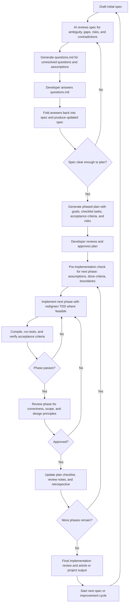

# Human-Gated Spec-Driven AI Development

## Abstract

**Human-Gated Spec-Driven AI Development** is a practical workflow for using AI in software development without surrendering design authority, review discipline, or code quality. It combines specification-first thinking, structured clarification, phased planning, test-driven implementation, code review gates, and iterative refinement. The goal is not merely to make AI-generated code faster. The goal is to make AI-assisted delivery more reliable, reviewable, and transferable across sessions, agents, and developers.

This article describes the process, explains why it matters, shows how it works in practice, and outlines supporting references from AI governance, human-in-the-loop design, agile delivery, code review, and emerging spec-driven development practices.

---

## Why This Process Exists

AI tools can accelerate software work dramatically, but unstructured usage creates predictable problems:

- implementation starts before requirements are clear
- the model silently makes architectural choices
- the generated code drifts beyond the intended scope
- code quality varies across sessions
- context windows fill up and continuity is lost
- review becomes reactive instead of designed into the workflow

In practice, many teams discover that the biggest challenge is not getting AI to write code. The biggest challenge is creating a process that keeps humans in charge of requirements, sequencing, boundaries, and approval while still benefiting from AI speed.

Human-Gated Spec-Driven AI Development addresses that problem directly.

---

## Core Idea

The workflow treats the **specification as the source of truth** and the **developer as the approval authority**. AI is used throughout the lifecycle, but always within explicit gates.

At a high level, the loop is:

1. Define or refine the spec.
2. Resolve ambiguities and missing constraints.
3. Generate a phased plan with checklists.
4. Approve the plan.
5. Implement one phase only.
6. Validate through tests, compilation, and review.
7. Update artifacts and repeat.
8. Start the next cycle when a new spec or improvement is needed.

This makes the process both **iterative within a project** and **cyclical across projects**.

---

## Process Flow



---

## The Workflow in Detail

### 1. Draft the Initial Spec

The process starts with a written spec. It does not need to be perfect, but it does need to state enough intent to anchor the rest of the work.

A useful spec usually includes:

- objective
- problem statement
- users or stakeholders
- functional requirements
- non-functional requirements
- constraints
- non-goals
- risks
- acceptance criteria

The spec does not need to solve every detail up front. It needs to make the intended outcome legible.

### 2. Review the Spec Before Planning

The AI should not jump directly from vague requirements to code. Instead, it should first review the spec for:

- ambiguity
- contradiction
- missing constraints
- unspoken assumptions
- edge cases
- likely implementation traps

This shifts the conversation from “write code” to “clarify intent.”

### 3. Capture Open Questions in `questions.md`

Inline clarification in chat often becomes noisy and hard to reuse. A better pattern is to create a transient markdown artifact such as `docs/questions.md`.

That file captures:

- unanswered questions
- assumptions to confirm
- unresolved tradeoffs
- edge-case prompts
- missing acceptance criteria

The developer answers the file directly. The AI then folds those answers back into the spec. After the spec is updated, `questions.md` can be discarded or ignored.

This is especially useful when work spans multiple sessions or agents.

### 4. Freeze a Working Spec

Once the important ambiguities are resolved, the team has a **working spec**. It is not necessarily final for all time, but it is stable enough to plan against.

This matters because planning against an unstable spec produces unstable implementation.

### 5. Generate a Phased Plan

The plan should break work into small, reviewable phases. Each phase should have:

- a clear goal
- a task checklist
- scope boundaries
- acceptance criteria
- risks or blockers
- out-of-scope notes

A practical plan format is a markdown document such as `docs/001-plan.md`, where each phase is a section header and each task is tracked with checklist markers:

- `[ ]` not started
- `[-]` in progress
- `[x]` completed
- `[!]` blocked

This makes the plan handoff-friendly and session-friendly.

### 6. Approve the Plan Before Implementation

The developer reviews the phased plan before code is generated. This is a key human gate.

The review can:

- reorder phases
- split large phases
- tighten acceptance criteria
- reduce risk earlier
- remove speculative work

This is where the human prevents the AI from optimizing a poor sequence.

### 7. Implement One Phase Only

The AI then works on **one phase at a time**.

Before implementation, it should restate:

- the phase goal
- assumptions in force
- what “done” means
- what is explicitly out of scope

This simple restatement often prevents scope creep.

For implementation, a strong default is **red/green TDD** where feasible:

1. write or identify the failing test
2. make the smallest change to pass
3. refactor while preserving behavior
4. ensure compilation and test success

The AI should not silently implement later phases “while it is there.”

### 8. Validate Before Declaring Completion

Phase completion should require evidence, not confidence.

That normally means:

- the code compiles or builds
- relevant tests pass
- acceptance criteria are checked
- scope boundaries were respected

If the phase fails those checks, it loops back into implementation rather than moving forward.

### 9. Review the Phase

Each completed phase should be reviewed against:

- correctness
- acceptance criteria
- maintainability
- readability
- architectural fit
- design principles

A useful review lens includes:

- **SOLID**
- **DRY**
- **YAGNI**
- **KISS**
- separation of concerns
- coupling and cohesion
- testability

The goal of the review is not to nitpick. It is to keep code health from degrading one phase at a time.

### 10. Update Artifacts and Repeat

Once a phase is approved, the workflow updates the durable artifacts:

- plan checklist
- phase review notes
- phase retrospective

A common naming convention is:

- `docs/001-spec.md`
- `docs/001-plan.md`
- `docs/001-phase-01-review.md`
- `docs/001-phase-01-retro.md`

The numeric prefix groups related artifacts together and keeps them ordered. This is especially useful when work crosses tools, sessions, or agents.

---

## Why “Human-Gated” Matters

The most important word in the title is **human-gated**.

This process does not assume the AI is an autonomous software engineer. It assumes AI is a powerful collaborator that still requires:

- human judgment
- human approval
- human accountability
- human responsibility for tradeoffs and correctness

The human gates are what make the process safe to scale.

Without gates, AI can move quickly in the wrong direction. With gates, speed becomes more trustworthy.

---

## Why “Spec-Driven” Matters

The second important word is **spec-driven**.

In many AI coding workflows, the code becomes the first concrete artifact and the requirements become retroactive explanation. That is backwards.

A spec-driven workflow makes the spec the control plane for:

- planning
- implementation
- review
- testing
- revision

When the spec changes, the plan can change. When the plan changes, implementation can change. But the project remains anchored to explicit intent.

---

## Advantages of the Process

### Better Quality Control

Review gates and acceptance criteria reduce the chance that AI-generated code is merged simply because it “looks plausible.”

### Better Use of AI

The process uses AI where it is strongest:

- finding ambiguity
- drafting structured artifacts
- generating candidate plans
- implementing bounded tasks
- performing structured reviews

### Better Continuity Across Sessions

Chat-based workflows break down when tokens run out or context becomes compressed. Durable markdown artifacts solve this problem by moving project state into files instead of relying on chat memory.

### Easier Handoffs

A new agent or a new session can resume from the docs rather than reconstructing intent from conversation history.

### Less Rework

Clarifying the spec before coding usually reduces mid-stream corrections.

---

## Potential Limitations

This workflow is not free.

It introduces structure, which means it can feel slower for trivial tasks. For very small changes, a lighter version of the process may be enough.

Possible downsides include:

- more up-front writing
- more artifact maintenance
- temptation to over-formalize small work
- review overhead if phases are too tiny

The solution is not to abandon the workflow. The solution is to right-size it.

For a small task, the lightweight version might be:

- short spec
- quick AI critique
- 2 to 4 step plan
- implement step 1 only
- review and continue

---

## Example of an Early Ad Hoc Form

An early, ad hoc form of this process can be seen in this repository:

- <https://github.com/COHBE/fdsh-mock-ridp-rba-service/tree/EXV-490>

That example is useful not because it perfectly formalizes the full methodology, but because it shows the pattern emerging in practice:

- structured planning artifacts
- iterative, phase-based work
- explicit review checkpoints
- AI-assisted implementation under controlled scope

A formalized version of Human-Gated Spec-Driven AI Development generalizes those patterns into a reusable workflow.

---

## Recommended Artifact Conventions

For teams or individuals using this process regularly, a simple opinionated file layout helps a lot.

```text
docs/
  001-spec.md
  001-plan.md
  001-phase-01-review.md
  001-phase-01-retro.md
  002-spec.md
  002-plan.md
```

Transient clarification artifact:

```text
docs/questions.md
```

Recommended rules:

- keep numbered artifacts for durable project state
- keep `questions.md` transient
- use the same numeric prefix for one spec/plan cycle
- update the checklist as work progresses
- leave enough state in plan, review, and retro files for a fresh session to continue

---

## A Practical Operating Sequence

A concise operating sequence for the workflow looks like this:

1. Draft `001-spec.md`
2. Run spec review
3. Generate `questions.md`
4. Answer `questions.md`
5. Fold answers back into `001-spec.md`
6. Generate `001-plan.md`
7. Approve the plan
8. Implement the next incomplete phase
9. Verify build and tests
10. Review the phase
11. Update plan and retrospective
12. Repeat until done
13. Perform final review
14. Start the next spec cycle

---

## Relationship to Broader Best Practices

Human-Gated Spec-Driven AI Development is not invented in isolation. It sits at the intersection of several established bodies of practice.

### Human-in-the-Loop AI

Human oversight is a core idea in responsible AI system design. In this workflow, the oversight mechanism is operationalized as explicit review gates.

### AI Governance and Risk Management

Risk management frameworks for AI emphasize governance, measurement, and managed operation. This workflow brings those ideas into day-to-day engineering practice by turning them into concrete checkpoints.

### Agile and Incremental Delivery

The process aligns well with incremental delivery and adaptation. The plan is not a rigid contract. It is a living document that is revised as the team learns.

### Code Review and Code Health

The workflow treats review as a code health mechanism, not just a bug-catching step. That distinction matters when AI can generate code faster than teams can comfortably reason about it.

### Spec-Driven Development

Emerging spec-driven approaches in AI-assisted coding reinforce the value of making the specification central rather than incidental.

---

## Selected Supporting References

The following references support the major ideas behind this workflow.

- **NIST. _Artificial Intelligence Risk Management Framework (AI RMF 1.0)._**  
  <https://www.nist.gov/publications/artificial-intelligence-risk-management-framework-ai-rmf-10>

- **NIST. _AI RMF Playbook._**  
  <https://airc.nist.gov/airmf-resources/playbook/>

- **Amershi, Saleema, et al. _Guidelines for Human-AI Interaction._**  
  <https://www.microsoft.com/en-us/research/publication/guidelines-for-human-ai-interaction/>

- **Beck, Kent, et al. _Manifesto for Agile Software Development._**  
  <https://agilemanifesto.org/>

- **_Principles behind the Agile Manifesto._**  
  <https://agilemanifesto.org/principles.html>

- **Google. _Google Engineering Practices Documentation._**  
  <https://google.github.io/eng-practices/>

- **Google. _Introduction to Code Review._**  
  <https://google.github.io/eng-practices/review/>

- **GitHub. _Responsible AI pair programming with GitHub Copilot._**  
  <https://github.blog/ai-and-ml/github-copilot/responsible-ai-pair-programming-with-github-copilot/>

- **Piskala, Deepak Babu. _Spec-Driven Development: From Code to Contract in the Age of AI Coding Assistants._**  
  <https://arxiv.org/abs/2602.00180>

- **Fowler, Martin. _Incremental Migration._**  
  <https://martinfowler.com/bliki/IncrementalMigration.html>

- **Fowler, Martin. _Foreword to Building Evolutionary Architectures._**  
  <https://martinfowler.com/articles/evo-arch-forward.html>

---

## Conclusion

Human-Gated Spec-Driven AI Development is a disciplined way to use AI without letting the workflow dissolve into prompt-driven improvisation.

It keeps the spec central. It makes implementation incremental. It uses artifacts instead of fragile chat memory. It inserts human approval where approval matters. And it treats AI as a powerful collaborator that works best inside a thoughtfully designed process.

As AI tooling becomes more capable, the need for better process will increase, not decrease. Faster code generation makes disciplined planning, review, and accountability more important.

That is why the value of this approach is not only technical. It is organizational. It helps teams adopt AI in a way that improves quality, preserves human judgment, and creates reusable engineering practice.
