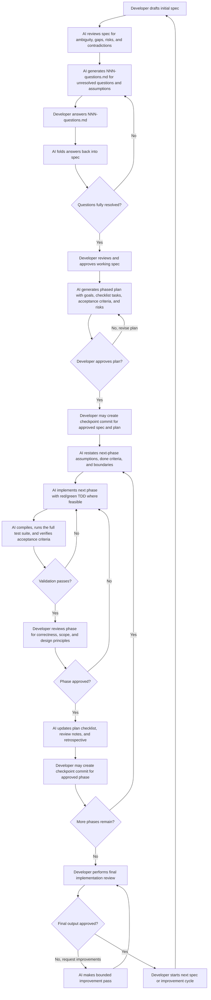

# Human-Gated Spec-Driven AI Development

## Table of Contents

- [Abstract](#abstract)
- [Quick Start](#quick-start)
- [Why This Process Exists](#why-this-process-exists)
- [Why “Human-Gated” Matters](#why-human-gated-matters)
- [Why “Spec-Driven” Matters](#why-spec-driven-matters)
- [Advantages of the Process](#advantages-of-the-process)
- [Potential Limitations](#potential-limitations)
- [Who This Is For](#who-this-is-for)
- [Choosing the Right Weight](#choosing-the-right-weight)
- [Process Flow](#process-flow)
- [The Workflow in Detail](#the-workflow-in-detail)
- [Recommended Artifact Conventions](#recommended-artifact-conventions)
- [Compact Worked Example](#compact-worked-example)
- [What This Process Does Not Solve](#what-this-process-does-not-solve)
- [How to Measure Whether It Helps](#how-to-measure-whether-it-helps)
- [Relationship to Broader Best Practices](#relationship-to-broader-best-practices)
- [Selected Supporting References](#selected-supporting-references)
- [Conclusion](#conclusion)
- [Supporting Skill](#supporting-skill)

## Abstract

**Human-Gated Spec-Driven AI Development** is a practical way to use AI for real software work without giving up control of requirements, sequencing, review, or quality. It makes the spec the source of truth, keeps approval with the developer, and turns chat-only progress into durable artifacts that survive across sessions, tools, and teammates.

The payoff is simple: less scope drift, clearer review points, better handoffs, and fewer moments where fast AI output outruns human understanding.

---

## Quick Start

If you want the shortest usable version of this workflow, do this:

1. The developer writes a short spec in `docs/NNN-spec.md`.
2. The AI reviews the spec for ambiguity, missing constraints, and risky assumptions.
3. The AI captures unresolved questions in `docs/NNN-questions.md`, and the developer answers them.
4. The AI folds those answers back into the spec and either deletes `docs/NNN-questions.md` if clarification is complete or refreshes it with only the remaining unresolved items.
5. Steps 3 and 4 repeat until the spec is clear enough to plan.
6. The developer reviews and approves the working spec.
7. The AI generates a phased plan, and the developer reviews it, either requesting revisions or approving it.
8. Once the spec and plan are approved, the developer should strongly consider creating a checkpoint commit before implementation begins.
9. The AI implements one phase only, runs the full test suite, and updates the relevant artifacts before the developer reviews the result.
10. When a phase is approved, the developer should strongly consider creating another checkpoint commit before beginning the next phase.
11. After the last phase, the developer performs a final implementation review and can either request improvements or approve completion.

In one sentence: the spec stays primary, the human stays in charge, and the AI only moves through explicit gates.

---

## Why This Process Exists

AI tools can accelerate software work dramatically, but unstructured usage creates predictable problems:

- implementation starts before requirements are clear
- the model silently makes architectural choices
- the generated code drifts beyond the intended scope
- code quality varies across sessions
- context windows fill up and continuity is lost
- review becomes reactive instead of designed into the workflow

In practice, many teams discover that the biggest challenge is not getting AI to write code. The biggest challenge is creating a process that keeps humans in charge of requirements, sequencing, boundaries, and approval while still benefiting from AI speed.

Human-Gated Spec-Driven AI Development addresses that problem directly.

---

## Why “Human-Gated” Matters

The most important word in the title is **human-gated**.

This process does not assume the AI is an autonomous software engineer. It assumes AI is a powerful collaborator that still requires:

- developer judgment
- developer approval
- developer accountability
- developer responsibility for tradeoffs and correctness

The developer gates are what make the process safe to scale.

Without gates, AI can move quickly in the wrong direction. With gates, speed becomes more trustworthy.

At minimum, the workflow expects developer approval at four points:

1. developer approval of the working spec
2. developer approval of the phased plan
3. developer approval of each completed phase
4. developer approval of final completion or release

The developer also remains responsible for repository and delivery actions:

- code review decisions
- commits and branch history
- pull requests and GitHub review handling

In this workflow, the AI prepares work for review, but the human remains the delivery authority.

---

## Why “Spec-Driven” Matters

The second important word is **spec-driven**.

In many AI coding workflows, the code becomes the first concrete artifact and the requirements become retroactive explanation. That is backwards.

A spec-driven workflow makes the spec the control plane for:

- planning
- implementation
- review
- testing
- revision

When the spec changes, the plan can change. When the plan changes, implementation can change. But the project remains anchored to explicit intent.

This is what gives the workflow traceability. Requirements, sequencing, implementation, and review all remain connected to an explicit artifact rather than drifting through chat history.

---

## Advantages of the Process

### Better Quality Control

Review gates and acceptance criteria reduce the chance that AI-generated code is merged simply because it “looks plausible.”

### Better Use of AI

The process uses AI where it is strongest:

- finding ambiguity
- drafting structured artifacts
- generating candidate plans
- implementing bounded tasks
- performing structured reviews

### Better Continuity Across Sessions

Chat-based workflows break down when tokens run out or context becomes compressed. Durable markdown artifacts solve this problem by moving project state into files instead of relying on chat memory.

### Easier Handoffs

A new agent or a new session can resume from the docs rather than reconstructing intent from conversation history.

### Less Rework

Clarifying the spec before coding usually reduces mid-stream corrections.

---

## Potential Limitations

This workflow is not free.

It introduces structure, which means it can feel slower for trivial tasks. For very small changes, a lighter version of the process may be enough.

Possible downsides include:

- more up-front writing
- more artifact maintenance
- temptation to over-formalize small work
- review overhead if phases are too tiny

The solution is not to abandon the workflow. The solution is to right-size it.

For a small task, the lightweight version might be:

- developer writes a short spec
- AI performs a quick critique
- AI drafts a 2 to 4 step plan
- AI implements step 1 only
- developer reviews and decides whether to continue

Even in the lightweight version, the same principles still apply: clarify intent before coding, keep scope bounded, and require evidence before calling work complete.

---

## Who This Is For

This workflow is most useful for:

- solo developers who want more discipline when using AI
- teams that need clearer review gates and handoff artifacts
- projects where correctness, traceability, or architectural control matter

It is less necessary for one-off throwaway scripts or tiny low-risk changes.

---

## Choosing the Right Weight

Not every task needs the full version of the process.

| Situation | Recommended Process |
| --- | --- |
| Tiny bug fix or copy update | developer writes a short spec, AI critiques it, AI drafts a short plan, AI implements |
| Medium feature or refactor | developer writes the spec, AI reviews and questions it, AI iterates on clarification until the spec is ready, AI drafts a phased plan, developer gates implementation |
| High-risk or multi-session work | full workflow with numbered artifacts, developer approvals, and AI-maintained review and retrospective artifacts |

---

## Process Flow



---

## The Workflow in Detail

### 1. Draft the Initial Spec

The process starts with a written spec prepared by the developer. It does not need to be perfect, but it does need to state enough intent to anchor the rest of the work.

A useful spec usually includes:

- objective
- problem statement
- users or stakeholders
- functional requirements
- non-functional requirements
- constraints
- non-goals
- risks
- acceptance criteria

The spec does not need to solve every detail up front. It needs to make the intended outcome legible.

### 2. Review the Spec Before Planning

The AI should not jump directly from vague requirements to code. Instead, it should first review the spec for:

- ambiguity
- contradiction
- missing constraints
- unspoken assumptions
- edge cases
- likely implementation traps

This shifts the conversation from “write code” to “clarify intent.”

### 3. Capture Open Questions in `NNN-questions.md`

Inline clarification in chat often becomes noisy and hard to reuse. A better pattern is for the AI to create a transient markdown artifact such as `docs/NNN-questions.md`.

That file captures:

- unanswered questions
- assumptions to confirm
- unresolved tradeoffs
- edge-case prompts
- missing acceptance criteria

The developer answers the file directly. The AI then folds those answers back into the spec. If all important clarification is complete, `NNN-questions.md` should usually be deleted. If important questions remain, the AI refreshes `NNN-questions.md` so it contains only the still-unresolved questions. That clarification loop repeats until the spec is ready to plan. Only keep a resolved questions file if there is a specific reason to preserve it, and then mark it clearly as transient and obsolete.

Using the same numeric prefix as the related spec and plan reduces the chance of collisions when multiple workstreams are active at the same time. It also makes accidental commits less confusing if a transient questions file does end up in version control.

### 4. Freeze a Working Spec

Once the important ambiguities are resolved and the developer is satisfied with the result, the team has a **working spec**. It is not necessarily final for all time, but it is stable enough to plan against.

This matters because planning against an unstable spec produces unstable implementation.

This is not waterfall. The spec is stable enough to plan against, not immutable. The process expects revision when new information appears, but it makes those revisions explicit instead of accidental.

This is also a developer gate. Before planning begins, the developer should explicitly approve the working spec.

### 5. Generate a Phased Plan

After the developer approves the working spec, the AI should generate a plan that breaks work into small, reviewable phases. Each phase should have:

- a clear goal
- a task checklist
- scope boundaries
- acceptance criteria
- risks or blockers
- out-of-scope notes

A practical plan format is a markdown document such as `docs/001-plan.md`, where each phase is a section header and each task is tracked with checklist markers:

- `[ ]` not started
- `[-]` in progress
- `[x]` completed
- `[!]` blocked

This makes the plan handoff-friendly and session-friendly.

### 6. Approve the Plan Before Implementation

The developer reviews the phased plan before code is generated. This is a key developer gate.

The review can:

- reorder phases
- split large phases
- tighten acceptance criteria
- reduce risk earlier
- remove speculative work

If the plan is not acceptable yet, the AI should revise it and return to the same approval gate before implementation starts.

This is where the developer prevents the AI from optimizing a poor sequence.

Once the working spec and phased plan are both approved, that is a strong checkpoint for a commit. If implementation later drifts or fails badly, the developer has a clean rollback point and the AI can attempt the implementation again from a known-good baseline.

### 7. Implement One Phase Only

The AI then works on **one phase at a time**.

Before implementation, the AI should restate:

- the phase goal
- assumptions in force
- what “done” means
- what is explicitly out of scope

This simple restatement often prevents scope creep.

For implementation, a strong default is **red/green TDD** where feasible:

1. write or identify the failing test
2. make the smallest change to pass
3. refactor while preserving behavior
4. ensure compilation and test success

The AI should not silently implement later phases “while it is there.”

During implementation, the plan should be kept current. As work progresses, the AI should update checklist items to show what is in progress, what is completed, and what is blocked. If something is blocked, the plan should say why so the developer can review the actual project state rather than a stale snapshot.

### 8. Validate Before Declaring Completion

Phase completion should require evidence, not confidence.

That normally means the AI performs the checks and the developer reviews the evidence:

- the code compiles or builds
- targeted tests pass during iteration
- the full project test suite passes before the phase is declared complete
- acceptance criteria are checked
- scope boundaries were respected

If the phase fails those checks, the AI loops back into implementation rather than moving forward. A phase is not done until validation passes and the developer approves it.

### 9. Review the Phase

The developer should review each completed phase against:

- correctness
- acceptance criteria
- maintainability
- readability
- architectural fit
- design principles

A useful review lens includes:

- **SOLID**
- **DRY**
- **YAGNI**
- **KISS**
- separation of concerns
- coupling and cohesion
- testability

The goal of the review is not to nitpick. It is to keep code health from degrading one phase at a time.

If helpful, the developer can also ask the AI to assist with a more formal phase review. In the supporting skill, that optional helper stage is `review-phase`. It does not replace the developer's review authority. It adds a structured second pass and can record findings in a review artifact.

### 10. Record the Outcome and Decide What Happens Next

By the time the developer reaches this decision point, the plan checklist should already reflect the current implementation state. During implementation, the AI should have been updating in-progress, completed, and blocked items so the developer could see what changed and what, if anything, prevented completion.

Once a phase is approved, the AI updates the remaining durable artifacts that record the approved outcome:

- phase review notes
- phase retrospective

A common naming convention is:

- `docs/001-spec.md`
- `docs/001-plan.md`
- `docs/001-phase-01-review.md`
- `docs/001-phase-01-retro.md`

Those updates are not the same as validation. Validation happens in the prior step. This step records the approved outcome so the project state is accurate for the next session, agent, or phase.

The developer can then decide whether to continue to the next phase, revise the plan, or stop the cycle.

An approved phase is also a strong checkpoint for a commit before the next phase begins. That gives the team a stable recovery point between phases and makes it easier to retry or rethink later work without losing approved progress.

The numeric prefix groups related artifacts together and keeps them ordered. This is especially useful when work crosses tools, sessions, or agents.

### 11. Final Review and Improvement Loop

After the last planned phase is complete, the developer performs a final implementation review across the full spec and plan.

That final review does not have to be a one-way approval step. The developer may identify cross-phase issues, documentation gaps, cleanup opportunities, or broader design improvements that should be addressed before calling the work complete.

If that happens, the AI can make another bounded improvement pass and return the work for review again. The cycle repeats until the developer approves the final output.

The same principle applies here as in earlier gates: approval should be explicit, and improvement loops should be deliberate rather than accidental.

If helpful, the developer can also ask the AI to assist with a full-project final review. In the supporting skill, that optional helper stage is `final-review`. It can surface cross-phase issues and provide structured go/no-go guidance, but the developer still decides whether the work is complete.

---

## Recommended Artifact Conventions

For teams or individuals using this process regularly, a simple opinionated file layout helps a lot.

```text
docs/
  NNN-spec.md
  NNN-plan.md
  NNN-phase-01-review.md
  NNN-phase-01-retro.md
  NNN+1-spec.md
  NNN+1-plan.md
```

Transient clarification artifact:

```text
docs/NNN-questions.md
```

Recommended rules:

- keep numbered artifacts for durable project state
- keep `NNN-questions.md` transient
- use the same numeric prefix as the related spec and plan
- use the same numeric prefix for one spec/plan cycle
- update the checklist as work progresses
- leave enough state in plan, review, and retro files for a fresh session to continue

---

## Compact Worked Example

One small example makes the artifact pattern easier to picture.

Example `docs/001-spec.md`:

```md
# Add CSV Export for Admin Reports

## Objective
Allow admin users to export the current report view as CSV.

## Constraints
- export must respect active filters
- only admins can access the feature
- large exports can be generated asynchronously

## Non-Goals
- no scheduled exports
- no PDF export

## Acceptance Criteria
- admin can request a CSV export from the report page
- exported data matches the filtered table contents
- non-admin users do not see the export action
```

Example `docs/001-questions.md`:

```md
# Open Questions

## Must Answer
- Should large exports block the UI or run in the background?
- What is the maximum allowed row count for synchronous export?

## Useful Clarifications
- Should filenames include the report name and timestamp?
- Should export actions be logged for audit purposes?
```

Example `docs/001-plan.md`:

```md
## Phase 01 - Access and request flow

Goal: Add the admin-only export trigger and request handling.

### Tasks
- [ ] add export action to admin report UI
- [ ] enforce admin-only authorization on export endpoint
- [ ] add tests for access control and request submission

### Acceptance criteria
- admins can request an export
- non-admins cannot see or invoke the export

## Phase 02 - CSV generation and delivery

Goal: Generate a CSV that matches the active filters and make it downloadable.

### Tasks
- [ ] generate CSV from filtered report data
- [ ] handle large exports asynchronously
- [ ] add tests for content correctness and delivery flow

### Acceptance criteria
- exported rows match the filtered view
- large exports complete without blocking the request path
```

---

## What This Process Does Not Solve

A good process helps, but it does not replace engineering judgment.

This workflow does not automatically fix:

- weak product judgment
- poor test strategy
- unclear ownership
- under-skilled reviewers
- teams that over-trust AI-generated code or AI-generated reviews

The workflow is strongest when paired with clear ownership, solid testing discipline, and thoughtful technical leadership.

---

## How to Measure Whether It Helps

Teams adopting this workflow can evaluate it with simple practical signals:

- fewer scope surprises during implementation
- fewer review rounds caused by misunderstood requirements
- faster recovery when work resumes in a new session
- lower defect rates in AI-assisted changes
- more consistent documentation of tradeoffs and decisions

The exact metrics will vary by team, but the point is to measure whether the workflow improves predictability, not just speed.

---

## Relationship to Broader Best Practices

Human-Gated Spec-Driven AI Development is not invented in isolation. It sits at the intersection of several established bodies of practice.

### Human-in-the-Loop AI

Human oversight is a core idea in responsible AI system design. In this workflow, the oversight mechanism is operationalized as explicit review gates.

### AI Governance and Risk Management

Risk management frameworks for AI emphasize governance, measurement, and managed operation. This workflow brings those ideas into day-to-day engineering practice by turning them into concrete checkpoints.

### Agile and Incremental Delivery

The process aligns well with incremental delivery and adaptation. The plan is not a rigid contract. It is a living document that is revised as the team learns.

### Code Review and Code Health

The workflow treats review as a code health mechanism, not just a bug-catching step. That distinction matters when AI can generate code faster than teams can comfortably reason about it.

### Spec-Driven Development

Emerging spec-driven approaches in AI-assisted coding reinforce the value of making the specification central rather than incidental.

---

## Selected Supporting References

The following references support the major ideas behind this workflow.

- **IBM Technology. _Spec-Driven Development: AI Assisted Coding Explained._**  
  <https://www.youtube.com/watch?v=mViFYTwWvcM>

- **DeepLearning.AI. _Spec-Driven Development with Coding Agents._**  
  <https://www.deeplearning.ai/alpha/short-courses/spec-driven-development-with-coding-agents/>

- **Amershi, Saleema, et al. _Guidelines for Human-AI Interaction._**  
  <https://www.microsoft.com/en-us/research/publication/guidelines-for-human-ai-interaction/>

- **Google. _Introduction to Code Review._**  
  <https://google.github.io/eng-practices/review/>

- **GitHub. _Responsible AI pair programming with GitHub Copilot._**  
  <https://github.blog/ai-and-ml/github-copilot/responsible-ai-pair-programming-with-github-copilot/>

- **Dong, Tao, Harini Sampath, Ja Young Lee, Sherry Y. Shi, and Andrew Macvean. _From Correctness to Collaboration: Toward a Human-Centered Framework for Evaluating AI Agent Behavior in Software Engineering._**  
  <https://arxiv.org/abs/2512.23844>

- **Piskala, Deepak Babu. _Spec-Driven Development: From Code to Contract in the Age of AI Coding Assistants._**  
  <https://arxiv.org/abs/2602.00180>

---

## Conclusion

Human-Gated Spec-Driven AI Development is a disciplined way to use AI without letting the workflow dissolve into prompt-driven improvisation.

It keeps the spec central. It makes implementation incremental. It uses artifacts instead of fragile chat memory. It inserts developer approval where approval matters. And it treats AI as a powerful collaborator that works best inside a thoughtfully designed process.

As AI tooling becomes more capable, the need for better process will increase, not decrease. Faster code generation makes disciplined planning, review, and accountability more important.

That is why the value of this approach is not only technical. It is organizational. It helps teams adopt AI in a way that improves quality, preserves developer judgment, and creates reusable engineering practice.

If you want to try this approach, start with one medium-sized feature: the developer writes a short spec, the AI iterates on clarification until the spec is ready, the developer approves a phased plan, and the AI completes only phase one before the developer reviews the result.

---

## Supporting Skill

This workflow is supported by the `human-gated-spec-driven-ai-development` skill in `skills/human-gated-spec-driven-ai-development/`.

The skill is designed for local filesystem AI coding environments and maps natural requests onto one stage at a time:

- `review-spec`
- `generate-questions`
- `fold-questions`
- `generate-plan`
- `implement-next-phase`
- `review-phase` for optional AI-assisted formal phase review
- `final-review` for optional AI-assisted final review of the whole plan and implementation

In practice, the skill is triggered when your prompt clearly matches that workflow. The most reliable pattern is to name the skill directly, but natural prompts that mention the stage and numbered artifacts also work well.

The skill is intentionally human-gated. After a gated stage, the AI should pause, tell you what to review, and tell you what to run next if you approve. Running the next stage is treated as implicit approval to continue unless you say otherwise.

The clarification loop is intentionally single-path. After the AI generates `NNN-questions.md`, the next step is to answer that file and run `fold-questions`. The AI should then either:

- update the spec and delete `NNN-questions.md` if the answers are now sufficient
- or update the spec as far as possible and produce a refreshed `NNN-questions.md` containing only the remaining unresolved questions

That loop repeats until the AI produces an updated spec that is ready for developer approval. After that approval, the next stage is `generate-plan`.

### Installation

You can install this workflow in major agentic coding tools that support reusable skills or persistent repo instructions.

- **Codex**
  Follow the official Codex docs for skills and repo instructions:
  - <https://developers.openai.com/codex/skills>
  - <https://developers.openai.com/codex/explore/>
 
  This repo also includes [`deploy_codex.sh`](./deploy_codex.sh), which copies the skill to `~/.codex/skills/human-gated-spec-driven-ai-development` on bash-compatible systems.

- **Claude Code**
  Follow Anthropic's official skills documentation:
  - <https://support.claude.com/en/articles/12512180-use-skills-in-claude>

  In Claude's skills UI, upload the skill folder as a ZIP file after packaging `skills/human-gated-spec-driven-ai-development/`.

### Prompt Cookbook

These examples assume you are working on `docs/006-spec.md` and related artifacts.

#### Start with a spec review

Most explicit:

```text
Use the human-gated-spec-driven-ai-development skill to review-spec for docs/006-spec.md
```

Natural phrasing:

```text
Review spec 006-spec.md using the human-gated spec-driven workflow
```

Short form:

```text
Review-spec for 006-spec.md
```

#### Generate clarification questions

Most explicit:

```text
Use the human-gated-spec-driven-ai-development skill to generate-questions for 006-spec.md
```

Natural phrasing:

```text
Generate questions for 006-spec.md using the spec-driven workflow
```

Short form:

```text
Generate questions for 006-spec.md
```

Expected result:

- the AI creates `docs/006-questions.md`
- you answer that file directly
- you then ask the AI to fold the answers back into the spec
- the AI either deletes `docs/006-questions.md` if clarification is complete or gives you a refreshed `docs/006-questions.md` with only the still-open items

#### Fold answered questions back into the spec and continue the clarification loop

```text
Use the human-gated-spec-driven-ai-development skill to fold-questions from 006-questions.md into 006-spec.md
```

Natural phrasing:

```text
Fold questions from 006-questions.md back into the spec
```

Expected result:

- the AI updates `docs/006-spec.md`
- if the answers are sufficient, it deletes `docs/006-questions.md` by default
- if the answers are still not sufficient, it refreshes `docs/006-questions.md` with a smaller, cleaner set of unresolved questions
- once the updated spec is ready, you review and approve it before moving on to planning
- if approved, you continue by asking for `generate-plan`

#### Generate a phased plan after the working spec is approved

```text
Use the human-gated-spec-driven-ai-development skill to generate-plan for 006-spec.md
```

Natural phrasing:

```text
Generate plan for 006-spec.md
```

Expected result:

- the AI creates or updates `docs/006-plan.md`
- the plan is broken into reviewable phases with tasks, acceptance criteria, risks, and out-of-scope notes
- you review the phase order, acceptance criteria, risks, and out-of-scope notes
- if approved, you continue by asking for `implement-next-phase`

#### Implement one phase only

```text
Use the human-gated-spec-driven-ai-development skill to implement-next-phase for 006-plan.md
```

Natural phrasing:

```text
Implement the next phase for 006-plan.md
```

Expected result:

- the AI reads the current spec and plan
- it implements only the next incomplete phase
- it runs the full test suite before the phase can be considered done
- it updates plan status, validation evidence, and any requested review or retro artifacts
- it pauses for your review before the next step

#### Optionally record a formal phase review

```text
Use the human-gated-spec-driven-ai-development skill to review-phase for 006-plan.md
```

Natural phrasing:

```text
Review the completed phase for 006-plan.md
```

Expected result:

- the AI creates or updates `docs/006-phase-01-review.md`
- findings are classified as must-fix, should-fix, or optional improvements
- if you approve and continue, the next invocation acts as implicit approval to move forward

This stage is optional. It is an AI assistant for the developer's phase review, not a replacement for it.

#### Optionally run the final review

```text
Use the human-gated-spec-driven-ai-development skill to final-review for 006-spec.md and 006-plan.md
```

Natural phrasing:

```text
Run the final review for 006-spec.md and 006-plan.md
```

Expected result:

- the AI reviews the full implementation against the spec and plan
- it records final findings and go/no-go guidance
- you decide whether the work is complete or another cycle is needed

This stage is optional. It is an AI assistant for the developer's final review, not a replacement for it.

### Example Full Workflow

One complete session might look like this:

1. `Use the human-gated-spec-driven-ai-development skill to review-spec for docs/006-spec.md`
2. `Use the human-gated-spec-driven-ai-development skill to generate-questions for 006-spec.md`
3. answer `docs/006-questions.md`
4. `Use the human-gated-spec-driven-ai-development skill to fold-questions from 006-questions.md into 006-spec.md`
5. if the AI refreshed `docs/006-questions.md`, answer it and run `fold-questions` again
6. once the AI resolves the questions, review and approve `docs/006-spec.md`
7. `Use the human-gated-spec-driven-ai-development skill to generate-plan for 006-spec.md`
8. review and approve `docs/006-plan.md`
9. `Use the human-gated-spec-driven-ai-development skill to implement-next-phase for 006-plan.md`
10. review the code, tests, and plan updates
11. optionally `Use the human-gated-spec-driven-ai-development skill to review-phase for 006-plan.md`
12. repeat `implement-next-phase` and optional `review-phase` until complete
13. optionally `Use the human-gated-spec-driven-ai-development skill to final-review for 006-spec.md and 006-plan.md`

### Example Lightweight Workflow

For a very small change, you can ask for a lighter version of the process:

```text
Use the human-gated-spec-driven-ai-development skill in lightweight mode for docs/007-spec.md: review the spec, generate a compact plan, and stop for approval before implementation
```

You can also be even more direct:

```text
Use the human-gated-spec-driven-ai-development skill in lightweight mode for 007-spec.md
```

In lightweight mode, the same principles still apply:

- clarify intent before coding
- keep scope bounded
- pause for approval before implementation
- require evidence before calling the work complete

### Prompting Tips

- Name the skill directly when you want maximum reliability.
- Include the stage name when possible, such as `generate-plan` or `implement-next-phase`.
- Reference the numbered artifact explicitly, such as `006-spec.md` or `006-plan.md`.
- Keep requests scoped to one stage at a time.
- If you want the full artifact set, say so. If you want a lighter workflow, say `lightweight mode`.
