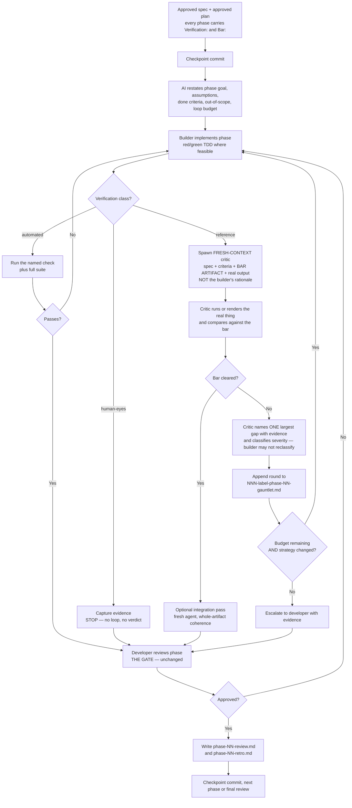

# The Gauntlet Loop, Applied to Human-Gated Spec-Driven AI Development

A clean writeup of the Gauntlet Loop pattern (Matt Shumer) and loop engineering generally, then a
concrete integration with the workflow in
[`rstehwien/spec-driven-ai-dev`](https://github.com/rstehwien/spec-driven-ai-dev).

Sources are listed at the end. Everything here is paraphrased and re-derived; templates are original
and written against this repo's artifact conventions.

> **Revision note (August 2026).** Second version. Changes from the first, all of which came from
> reading `pending-updates.md` and from Anthropic's July 2026 context-engineering guidance:
>
> - **Bars must be artifacts, not prose.** The largest correction. The first version treated prose
>   acceptance criteria as the bar throughout. See [Bars are artifacts](#bars-are-artifacts-not-prose).
> - **Loop selection is driven by verification class.** A gauntlet on a phase an assertion already
>   settles is pure cost. The proposed `gauntlet-phase` stage is withdrawn — the loop belongs to an
>   execution mode, not a human-invoked stage.
> - **The loop's exit condition must be a comparison, not a reviewer's verdict.** Added as an eighth
>   load-bearing property, because it is the one most often lost in reimplementation.
> - **Minimalism is a function of supervision,** not a universal virtue. New subsection.
> - **Loop budget moved out of the plan header** — a generated artifact cannot authorize the autonomy
>   that generated it.
> - **Example 3 substantially rewritten.** It recommended a gauntlet on what is really an `automated`
>   phase, which the cost rule now forbids.
> - Sourcing notes added for two widely repeated claims that do not survive checking.
>
> **Start with `gauntlet-integration-handoff.md`** if you are picking this up in a new session — it
> carries the settled decisions, the open ones, and the build order. This guide is the reasoning
> behind them. Note also that amendment A8 in the review document moves bar authoring from
> `generate-plan` to specification, which supersedes the timing described in Part 3 below; the
> mechanics are unchanged.

---

## Table of Contents

- [Part 1 — What the Gauntlet Loop Actually Is](#part-1--what-the-gauntlet-loop-actually-is)
  - [The loop in six moves](#the-loop-in-six-moves)
  - [Objective, metric, boundary](#objective-metric-boundary)
  - [The seven load-bearing properties](#the-seven-load-bearing-properties)
  - [What the Claude of Duty result does and does not prove](#what-the-claude-of-duty-result-does-and-does-not-prove)
  - [Bars are artifacts, not prose](#bars-are-artifacts-not-prose)
  - [Prompt engineering vs loop engineering](#prompt-engineering-vs-loop-engineering)
  - [Minimalism is a function of supervision](#minimalism-is-a-function-of-supervision)
- [Part 2 — Where the Two Methods Agree and Where They Fight](#part-2--where-the-two-methods-agree-and-where-they-fight)
  - [The genuine conflict](#the-genuine-conflict)
  - [The resolution: gauntlet inside the phase, gates around it](#the-resolution-gauntlet-inside-the-phase-gates-around-it)
  - [What each method fixes in the other](#what-each-method-fixes-in-the-other)
- [Part 3 — The Combined Workflow](#part-3--the-combined-workflow)
  - [Mapping OMB onto existing artifacts](#mapping-omb-onto-existing-artifacts)
  - [Flow](#flow)
  - [New artifact: the gauntlet log](#new-artifact-the-gauntlet-log)
  - [Loop selection by verification class](#loop-selection-by-verification-class)
- [Part 4 — Templates](#part-4--templates)
- [Part 5 — Four Worked Examples](#part-5--four-worked-examples)
- [Part 6 — Boundaries for Regulated and Enterprise Work](#part-6--boundaries-for-regulated-and-enterprise-work)
- [Part 7 — Failure Modes of the Combination](#part-7--failure-modes-of-the-combination)
- [Part 8 — When Not to Do This](#part-8--when-not-to-do-this)
- [Part 9 — Adoption Path and Measurement](#part-9--adoption-path-and-measurement)
- [Sources](#sources)

---

## Part 1 — What the Gauntlet Loop Actually Is

### The loop in six moves

A lead agent receives an ambitious goal plus a concrete example of what "great" looks like. From
there:

1. **Split.** The lead agent — not you — divides the artifact into the smallest pieces that can be
   improved and judged independently.
2. **Build.** Each important piece gets a builder subagent.
3. **Judge.** Each piece gets a *separate* critic with a *fresh context window*. The critic receives
   the goal, the rules, the reference, and the real artifact — never the builder's narrative about
   why its choices were reasonable.
4. **Compare.** The critic puts the output next to the reference, blind where blindness is possible,
   and picks the better one.
5. **Return.** If the reference wins, the critic names the single largest meaningful gap and hands it
   back with evidence.
6. **Repeat.** No fixed round count. The loop runs until the output clears the bar, gains stop being
   worth the cost, a boundary fires, or you stop it.

Optionally, at the end of each wave, one fresh agent does an integration pass over the whole artifact
— reconciling the seams that appear when many builders independently improved adjacent parts. This is
a real problem in practice and a cheap fix, but it is not the core of the pattern.

The core is: **split, build, judge independently, repeat.**

### Objective, metric, boundary

The smallest useful design card for any agent loop. Writing all three down forces vagueness into the
open *before* you spend hours of compute.

| Element | Question | Weak | Useful |
|---|---|---|---|
| **Objective** | What must become true? | "Improve the verification flow." | "A member with two pending verification types can see both, upload a document for each, and reach a terminal state without leaving the page." |
| **Metric** | What evidence proves an attempt got better or passed? | "It works." | "All acceptance criteria in `012-...-spec.md` pass; full suite green; a fresh critic prefers our rendering to the reference frame at 360px and 1440px." |
| **Boundary** | What may it touch, and when must it stop? | "Keep going until it's right." | "Local branch only. No schema DDL, no prod config, no outbound calls. Stop after 6 critic rounds, 90 minutes, or two consecutive rounds with no measurable gain." |

These three are the minimum, not the machinery. A loop that can repeat but cannot *observe* real
results is not looping — it is spinning. Real loops also need tools, durable state, error recovery,
scoped permissions, and an escalation path.

### The seven load-bearing properties

Shumer's original prompt is short and architecturally thin. Its power comes from seven properties,
and each one has a direct translation into engineering work.

**1. It names the destination, not the route.** The agent is told what success resembles and left to
choose the architecture and the work breakdown. Prescribing the decomposition replaces the model's
judgment with yours — and on large, unfamiliar artifacts the model often finds systems you would not
have thought to ask for.

**2. The bar is real and inspectable.** "Make it amazing" cannot be graded. Actual reference
screenshots can be placed beside a rendered frame. A test suite, latency budget, security checklist,
or reference implementation can be run. The distinguishing property of a good bar is that the agent
*cannot talk its way around it*.

**3. The artifact is decomposed.** "Improve the whole thing" is too large to generate useful feedback.
"Make this one element compare favorably against this one reference element" is small enough to attack
repeatedly. Decomposition is also what makes genuinely independent work parallelizable.

**4. The builder never grades its own homework.** A builder remembers every compromise and is
therefore excellent at explaining why each compromise was reasonable. You do not want reasonable; you
want independent. Fresh-context criticism is the single highest-leverage element of the pattern and
the one most often skipped.

**5. The critic inspects the artifact, not a summary.** Pixels for visual work. The running product
and the test output for software. The opened sources for research. The finished draft for prose. A
polished progress report is not evidence that the underlying work is good — and models are very good
at writing polished progress reports.

**6. There is no arbitrary final round.** The loop continues while meaningful gaps remain. In
production this must be *paired* with explicit time, token, cost, permission, and diminishing-return
boundaries. "Until perfect" is motivating language, not a safe stop condition.

**7. It can finish with an integration pass.** When many builders improve separate pieces, local
quality rises while global coherence degrades. One fresh agent inspects the complete result, resolves
conflicts, and smooths the seams — without redesigning anything.

**8. The exit condition is a comparison, not a verdict.** The loop ends when the output *beats the
reference*, not when the critic *stops objecting*. This is the property most often lost when people
reimplement the pattern, and losing it is silent:

| Exit condition | What satisfies it |
|---|---|
| "the critic reports no findings" | A critic that stops looking satisfies it perfectly. Indistinguishable from success. |
| "our output beats the bar" | A critic that stops looking produces no verdict, which is visibly not a pass. |

Absence-of-objection loops fail closed into false confidence. Presence-of-comparison loops fail open
into a missing verdict, which someone notices. A reviewer's satisfaction is not a bar no matter how
independent the reviewer is — independence reduces bias, it does not supply a standard. This is why
"spawn a fresh critic subagent" is necessary but nowhere near sufficient: fresh context makes a critic
less invested while giving it nothing to measure against.

### What the Claude of Duty result does and does not prove

Worth being precise, because the demo is what made the pattern spread.

**What happened:** one prompt to Claude Code, many hours unattended, a large fleet of subagents,
roughly 55,000 lines of Three.js, with every texture, mesh, animation, and sound generated in code.
The prompt and the full source are public.

**What it does not prove:** that a browser prototype reached AAA parity. Shumer's own assessment is
that every blind comparison still preferred the real Call of Duty frame. He stopped the run while it
was still improving.

**So the transferable result is the process, not the artifact.** The demanding reference is what kept
a long-running agent improving instead of halting at "pretty good for AI." A bar does not have to be
reachable to be useful — it has to be concrete enough to keep producing a next gap. That is a
genuinely different claim from "agents can now build AAA games," and it is the claim that survives
scrutiny.

Also worth noting: the Claude of Duty repo reports that broad fan-out performed *worse* than
sequential ownership for tightly coupled visual systems. Parallelism is a property of the work, not a
property of having subagents available.

### Bars are artifacts, not prose

The single most consequential detail about bars: **the medium matters as much as the content.**

Prose is a lossy encoding of a standard. A fresh critic reading the same acceptance criterion in a
fresh context on round three reaches a slightly different reading than it did on round one — not
because anything changed, but because prose admits multiple readings and fresh context is the entire
point of the critic. The target drifts while nobody moves it.

That is the mechanism behind the "moving goalposts" complaint in the criticism circulating about this
pattern — critics appearing to invent new deficiencies every round rather than converging. It is a
fidelity problem, not evidence that critics are unreliable and not an argument against specification.
More prose makes it worse. The same standard encoded as a test, a rendered mockup, or an anchored
rubric makes it go away, because those either pass or don't.

Ranked by fidelity, most to least:

| Bar medium | Why it holds still |
|---|---|
| A named test or measurement | Executes. One reading. |
| A reference implementation or working codebase to port from | Executes. Ambiguity resolves by inspection. |
| An HTML mockup or rendered artifact | Renders identically every round. |
| An anchored rubric | Dimensions with concrete pass/fail anchors, so scores reproduce across critics. |
| A screenshot | Stable, but says nothing about behavior, states, or edge cases. |
| Prose acceptance criteria | Re-interpreted every round. Not a bar. |

Anthropic's July 2026 context-engineering guidance for the Claude 5 generation reaches the same
conclusion from the model side. One of its six documented shifts moves away from simple markdown
specs toward richer references — test suites, code, HTML artifacts, and rubrics — on the grounds that
code is a higher-fidelity instruction than a description of code. It notes specifically that an HTML
mockup of a design outperforms both a prose description *and* a screenshot of it. That last point is
a mild correction to the original Gauntlet Loop advice, which used reference screenshots.

The practical rule: **a spec states intent; a bar is a separate artifact the spec points at.** Prose
acceptance criteria are inputs to a bar, never a bar themselves.

### Prompt engineering vs loop engineering

| | Prompt engineering | Loop engineering |
|---|---|---|
| Unit of work | One request/response | A continuing process across many attempts |
| Who picks the next step | Usually the human | The loop, from evidence |
| Feedback | Your written follow-up | Tests, screenshots, benchmarks, tool output, critics, gates |
| Memory | The current conversation | Conversation *plus* files, logs, trackers, plans |
| Stopping | You stop asking | A success, failure, budget, safety, or escalation condition fires |

This is not the end of prompting. The loop supplies the architecture; prompts still tell the planner,
builder, critic, and verifier how to do their jobs.

Two variants are worth keeping distinct:

- **Prompt-led Gauntlet Loop.** One orchestration prompt starts a split/build/criticize/revise run.
  Best for a single ambitious, inspectable artifact. Needs no bespoke loop code if the harness already
  has tools, long-running goals, and subagents.
- **Engineered recurring loop.** A reusable operating system around one or more agents. Needs
  triggers, durable state, connectors, permissions, verification, recovery. Best for recurring work:
  triage, CI investigation, nightly checks, migrations, repeated reports.

Human-gated spec-driven development is closer to the second. The Gauntlet is the first. That is the
whole reason the integration below is interesting rather than trivial.

### Minimalism is a function of supervision

The source advice is emphatic that shorter prompts are better: give the destination, not the route;
don't prescribe architecture, decomposition, or round count. That advice is correct in its original
setting and misleading outside it, and the reason is worth stating because it determines how long your
own prompts should be.

Shumer's setting has a human watching. He says so directly — the run was still improving when he
stopped it, and he recommends a live progress page precisely so you can check in and decide when to
stop. **The human is the stop condition.** Under that arrangement, boundaries written into the prompt
are redundant, and over-specifying only replaces the model's judgment with yours.

Remove the human from the run and every boundary that was implicit in "I'll stop it when I'm happy"
has to become explicit somewhere durable. So:

> Prompt minimalism is affordable in proportion to how closely a human is watching. Autonomy and
> minimalism trade off against each other; they are not independent virtues.

The useful corollary is that the two halves of the advice separate cleanly. What should stay minimal
is **decomposition** — let the lead agent choose phases and ordering, which is where model judgment
genuinely beats yours. What should be maximal is **boundaries and evidence requirements**. "Don't
prescribe the architecture" survives intact. "Keep it short" does not.

---

## Part 2 — Where the Two Methods Agree and Where They Fight

Both methods share a spine that is easy to miss under the stylistic differences:

- Evidence beats confidence. The spec-driven workflow refuses to call a phase done without a green
  suite and checked acceptance criteria; the Gauntlet refuses to accept a builder's summary.
- Decomposition is mandatory. Phases in one; independently judgeable pieces in the other.
- Intent is written down before work starts. The spec in one; the goal-plus-bar in the other.
- Structured review is a first-class stage, not an afterthought.

### The genuine conflict

| Dimension | Gauntlet Loop | Human-Gated SDD |
|---|---|---|
| Autonomy | Maximal — leave it alone for hours | Bounded — four explicit approval gates |
| Who decomposes | The lead agent, at run time | The developer approves an AI-drafted phased plan |
| Stop condition | "No arbitrary final round" | "One phase only, then stop for review" |
| State | Live progress page, mostly in-run | Durable numbered markdown, survives context death |
| Scope control | Emergent | Explicitly bounded, with out-of-scope notes per phase |
| Quality signal | Fresh critic vs a concrete reference | Acceptance criteria + full suite + human review |

These are not stylistic differences. "Fan out and keep looping until it's perfect" and "implement one
phase only, then pause for approval" are contradictory instructions if issued at the same scope.

### The resolution: gauntlet inside the phase, gates around it

The contradiction dissolves once you notice the two methods operate at different altitudes.

> **Human-gated SDD is the skeleton between phases. The Gauntlet Loop is the engine inside one phase.**

The Gauntlet's "no arbitrary final round" was never a claim about *scope* — it is a claim about
*iteration count within a fixed scope*. A phase with tight acceptance criteria and explicit
out-of-scope notes is exactly the right container: the loop can run hard because the walls are
already built.

So the gauntlet runs *between* `implement-next-phase` and the developer's phase review. Scope is
frozen by the approved plan. Autonomy is high inside those walls. The gate still fires at the end.

### What each method fixes in the other

**The Gauntlet fixes a real weakness in the spec-driven workflow.** In the current skill,
`implement-next-phase` and `review-phase` typically run in the same session, on the same context. That
is the builder grading its own homework — precisely the failure mode the Gauntlet exists to prevent.
The README already flags "teams that over-trust AI-generated code or AI-generated reviews" as
something the process does not solve. Fresh-context criticism is a concrete mechanism for that,
and it costs one subagent spawn.

**The spec-driven workflow fixes the Gauntlet's two biggest hazards.** Unbounded runs burn budget
against unreachable bars, and emergent decomposition drifts scope. An approved spec supplies a bar
that is *already agreed to by a human*, and an approved phase plan supplies walls the loop cannot
wander past. The gauntlet log turns the ephemeral live progress page into durable state that survives
a context reset — which is the entire design goal of the repo.

There is also a nice symmetry worth noticing: **the questions loop is already a gauntlet loop with a
human as the critic.** AI builds a spec critique, produces `NNN-<label>-questions-01.md`, the developer
judges against real intent, the AI folds the answers back, repeat until the bar is met. Same shape,
human judge. That is a good reason to be relaxed about the pattern rather than treat it as exotic.

---

## Part 3 — The Combined Workflow

### Mapping OMB onto existing artifacts

The three-element card maps onto artifacts you already produce. No new concepts required.

| OMB element | Source in the workflow |
|---|---|
| **Objective** | The phase `Goal` in `specs/NNN-<label>-plan.md`, anchored to the spec's objective |
| **Metric** | The phase's `Verification:` class and its `Bar:` — a resolvable path to a test, reference artifact, or rubric. Acceptance criteria and non-functional requirements are *inputs* to that bar, not the bar. |
| **Boundary** | The phase `Scope boundaries` and `Out-of-scope notes`, the loop budget from settings, and the human gate itself |

Two corrections to the obvious way of doing this.

**The metric is a named artifact, not a list of criteria.** See
[Bars are artifacts](#bars-are-artifacts-not-prose). A phase whose `Bar:` says "the acceptance
criteria above" has no bar.

**The loop budget does not belong in the plan.** This is tempting and wrong: at any autonomy level
above incremental, the plan is *generated inside the autonomous run*, so a budget living there is a
generated artifact authorizing the autonomy that generated it. The budget belongs where the execution
mode lives — a repo-level default, overridden by the approved spec header — and gets copied into
generated plans for reconstruction only, never as the source of authority.

Budget shape, wherever it lives:

```markdown
loop-budget:
  max-rounds: 5
  stop-on-recurring-finding-class: 3
  stop-on-diff-growth-beyond-plan: <N> lines
  escalate-on: missing requirement, unverifiable criterion, credential need,
               any change outside scope boundaries
```

Round count is the backstop, not the primary bound. A recurring *finding class* is the stronger
signal, because it distinguishes a loop that is adapting from one that is spinning — and because the
same class recurring usually means the spec is incomplete rather than the implementation deficient,
which is a different escalation with a different fix.

### Flow



Two things to read off this diagram.

The gate at `T` is unchanged from the existing workflow. Everything the loop adds happens *before* the
developer's authority is exercised, never instead of it.

Only one of the three branches is a gauntlet. That is the cost control, and it is structural rather
than a judgment call made per phase.

### New artifact: the gauntlet log

One new file per phase that used a loop, following the existing naming convention:

```
specs/NNN-<label>-phase-NN-gauntlet.md
```

This is the durable equivalent of the Gauntlet's live progress page. It is what lets a fresh context
answer "what has already been tried and failed?" — the question that most often gets re-litigated
after a context reset.

Template:

```markdown
# Phase NN Gauntlet Log — <label>

## Objective (from plan phase NN)
<one sentence>

## Bar / metric
- <acceptance criterion 1>
- <acceptance criterion 2>
- external reference: <path, URL, frame name, benchmark, or standard>
- automated gates: <suite, lint, static analysis, a11y, perf budget>

## Boundary
- may change: <paths / modules>
- must not touch: <paths / systems / data>
- budget: <rounds / time / cost>
- escalate on: <conditions>

## Rounds

### Round 01
- **Builder change:** <what was actually changed>
- **Verifier output:** <suite result, counts, timings — real numbers>
- **Critic verdict:** reference wins / ours wins / tie
- **Evidence:** <screenshot path, failing test name, query plan, log excerpt>
- **Largest gap identified:** <one gap, specific>
- **Next strategy:** <how round 02 differs — not a repeat>

### Round 02
...

## Failed approaches (do not retry without new information)
- <approach> — <why it failed> — <round>

## Stop reason
<bar cleared | budget exhausted | diminishing returns | escalated: reason>

## Handoff note for the next context
<what a fresh session needs to know that is not obvious from spec + plan>
```

The **Failed approaches** section is the highest-value part. It is the difference between a loop that
adapts and a loop that spins.

### Loop selection by verification class

The first version of this guide proposed a `gauntlet-phase` stage between `implement-next-phase` and
`review-phase`. **That proposal is withdrawn.** A gauntlet invoked by hand between implementation and
review is just reviewing twice, and it puts the loop at the wrong altitude: the loop is a property of
an execution mode, not a stage a human triggers. What survives is the critic brief content in
[Template 2](#template-2--fresh-context-critic-brief).

The replacement is a rule rather than a stage. The verification class determines which loop runs, and
the loop determines the cost:

| Class | Loop | Exit condition |
|---|---|---|
| `automated` | repair loop — run the named check, fix failures, rerun | the named check passes |
| `reference` | gauntlet — fresh-context critic compares the running artifact against the bar | the critic prefers our output, or a budget fires |
| `human-eyes` | none | implement, capture evidence, stop and report |

- **Never run a gauntlet on an `automated` phase.** A critic loop there pays for judgment that a named
  check performs for free. This is the largest avoidable cost in the workflow, and it is the real
  substance behind the cost criticism aimed at this pattern.
- If an `automated` phase passes its check but the result is still wrong, that is a defect in the check
  or the spec. Escalate it; do not add a critic to compensate for a bad assertion.
- **Never run a gauntlet on a `human-eyes` phase.** There is no bar, so the loop has nothing to
  converge on and will produce a confident verdict that looks like evidence.

Which yields a conclusion that inverts the usual criticism: **detailed specs do not make the gauntlet
expensive — they make most phases `automated`, and therefore ineligible for a gauntlet.** That is the
cheap outcome. A project with no automatable tier pays gauntlet prices for everything, because a critic
loop is its only available verification. Claude of Duty was such a project.

Existing stages change only slightly:

| Stage | Change |
|---|---|
| `review-spec` | also classifies each acceptance criterion, names its bar, and flags any criterion that cannot be evidenced at all |
| `generate-questions` / `fold-questions` | unchanged |
| `generate-plan` | assigns `Verification:` per phase and points each at a bar already present in the spec's bar table; marks `[!]` blocked if a needed bar is missing (see A8) |
| `implement-next-phase` | runs the loop matching the phase's class |
| `review-phase` | must run in a fresh context, not the implementation session; may cite the gauntlet log |
| `final-review` | reads all gauntlet logs for cross-phase patterns in failed approaches |

---

## Part 4 — Templates

### Template 1 — Gauntlet phase runner

Use after `implement-next-phase` has produced a green build.

```text
Run a bounded gauntlet loop on phase <NN> of specs/<NNN>-<label>-plan.md.

SCOPE IS FROZEN. The approved spec and plan define the objective, the acceptance criteria, and
the boundaries. Do not expand scope, do not implement later phases, do not refactor anything
outside the phase's scope boundaries. If you believe the plan is wrong, stop and say so —
do not fix it yourself.

OBJECTIVE
The phase goal exactly as written in the plan.

BAR (the metric — all must hold)
- the phase's Bar: artifact at <path> — the mockup, rubric, reference implementation, or named
  test that settles this phase. Compare against the artifact itself, not against a description
  of it, and not against the prose acceptance criteria.
- the full project test suite is green
- <automated gates: lint, static analysis, a11y, perf budget>

Phase acceptance criteria are inputs to that bar. If you find yourself judging the work by
re-reading the criteria rather than by comparing against the artifact, stop and say the bar is
missing.

LOOP
For each round:
1. Identify the highest-impact unmet criterion. One only.
2. Make one coherent change.
3. Run the real verifier. Record actual output, not a description of it.
4. Spawn a critic in a FRESH context. Give it: the spec, the phase acceptance criteria, the
   reference, and the real artifact. Do NOT give it your reasoning, your diff narrative, or
   any justification for choices you made.
5. The critic inspects the real artifact — running code, rendered output, test results,
   query plans — and names the single largest remaining gap with evidence.
6. Append the round to specs/<NNN>-<label>-phase-<NN>-gauntlet.md using the standard sections.
7. If the same failure recurs, you must change strategy before the next round. Repeating a
   failed action with the same evidence is spinning, not looping. Log it under Failed
   approaches.

BUDGET
Stop when: the bar is cleared; <N> rounds are used; <TIME> elapses; two consecutive rounds
produce no measurable gain; or the same blocker repeats without a new strategy.

FORBIDDEN WITHOUT MY APPROVAL
Commits, pushes, branch changes, PRs, schema DDL, migrations against any shared database,
dependency additions, config changes outside the phase scope, network calls to non-allowlisted
hosts, and any use of real production data.

WHEN YOU STOP
Write the stop reason and a handoff note in the gauntlet log, update the plan checklist,
summarize the remaining gaps with evidence, and pause for my phase review. Do not proceed to
review-phase, the next phase, or any commit.
```

### Template 2 — Fresh-context critic brief

Hand this to the critic subagent *by itself*. Its value depends entirely on what you leave out.

```text
You are an independent critic. You did not build this and you have no stake in it.

You are given:
- the spec: specs/<NNN>-<label>-spec.md
- the acceptance criteria for phase <NN> of specs/<NNN>-<label>-plan.md
- the reference / bar: <path or description>
- the real artifact: <how to run, render, or inspect it>

You are NOT given the builder's reasoning, and you should not ask for it. If someone offers you
an explanation of why a choice was reasonable, ignore it. Judge the artifact.

Do this:
1. Inspect the real artifact. Run it. Render it. Read the actual test output. Read the actual
   query plan. Do not grade a summary, a diff description, or a progress report.
2. Compare it against the bar. Where a blind A/B is possible — two rendered images, two
   response payloads, two query plans — do it blind and state which you prefer before learning
   which is ours.
3. Check every acceptance criterion individually and mark it pass / fail / unverifiable.
   "Unverifiable" is a legitimate and important verdict — say what evidence is missing.
4. Name the SINGLE largest meaningful gap. One. Not a list of nine. Attach the evidence a
   builder would need to fix it: failing test name, screenshot, viewport, line reference,
   measured number.
5. Separately flag anything you believe is out of scope for this phase but should be recorded.
   Do not treat out-of-scope items as gaps.

Do not propose an implementation. Do not soften the verdict to be agreeable. If the reference
wins, say the reference wins.
```

A note on blindness: real blind A/B works for rendered output, payloads, prose, and query plans. It
mostly does not work for source code — the provenance is obvious. For code, the substitute is context
isolation plus an explicit reference (a sibling module, a documented standard, a reference
implementation). Don't pretend to blindness you don't have; state which kind of independence you
actually achieved.

### Template 3 — Bar finder, for use during `review-spec`

The most common reason a gauntlet loop fails is that nobody could name the bar. That is a spec
defect, which means it belongs in the questions artifact.

```text
While reviewing specs/<NNN>-<label>-spec.md, do one additional thing: for each acceptance
criterion, identify the concrete, inspectable evidence that would settle it.

For each criterion, classify it:
- AUTOMATED — a test, benchmark, query plan, static-analysis rule, or measurement already
  settles it. Name the specific check.
- REFERENCE — settled by comparison against an existing artifact. Name the artifact and where
  it lives.
- JUDGMENT — needs a human. Say so plainly; do not invent a proxy metric.
- UNSETTLEABLE — cannot currently be evidenced at all.

Every UNSETTLEABLE criterion, and every criterion where the reference does not yet exist, becomes
a question in specs/<NNN>-<label>-questions-YY.md. Phrase it as a request for a bar, not a
request for an opinion. Example: "What existing artifact or measurement should we compare this
against?" rather than "How good should this be?"

Do not proceed to generate-plan while a must-have criterion is UNSETTLEABLE.
```

This is a real strengthening of the existing `review-spec` stage. "This criterion cannot be
evidenced" is one of the highest-value findings a spec review can produce, and it is easy to miss when
you are only looking for ambiguity and contradiction.

---

## Part 5 — Four Worked Examples

### Example 1 — Design-to-code parity (the strongest fit)

**Situation.** A phase implements a renewals detail page against approved designs.

This is the closest analogue to the original Claude of Duty setup, because the bar already exists and
is literally a picture. Design-to-code parity work is where the gauntlet earns its keep most obviously.

- **Objective.** Render the page so that layout, hierarchy, spacing, states, and responsive behavior
  match the approved design at the agreed viewports.
- **Metric.** `Verification: reference`. The bar is **a self-contained HTML mockup built from the
  design**, not exported PNGs — per
  [Bars are artifacts](#bars-are-artifacts-not-prose), a mockup beats a screenshot because it carries
  behavior, states, and responsive reflow rather than one frozen frame. Blind A/B between the mockup
  and the implementation at 360px and 1440px; zero horizontal overflow at 360px; no accessibility
  violations; all existing interaction tests still green.

  Building the mockup is real work, and it is the same work as building the bar. If you have already
  produced one to communicate a design to stakeholders, you have already produced the bar and only
  need to point at it.
- **Boundary.** Local branch. Markup and styles only — no changes to endpoints, no changes to
  copy that is legally reviewed, no new dependencies, no writes to the design tool. Six rounds max.
- **Split.** Information hierarchy, typography scale, spacing rhythm, component states
  (default/loading/error/empty), responsive breakpoints, and accessibility each get their own critic.
  These are genuinely independent, which is why fan-out helps here.

**Why blind A/B actually works here.** Two PNGs. The critic has no way to tell which is which unless
you tell it. That is the rare case, and you should exploit it when you have it.

**The output that matters most.** Not the closed gaps — the gaps the critic cannot close. A fresh
critic comparing a rendering to a design frame reliably surfaces states the design never specified:
what the error state looks like, what happens with a 60-character name, what the empty case shows.
Those are design gaps, not implementation gaps. They belong in a questions artifact for the designer,
and this is the single most useful byproduct of running a gauntlet on design work.

**Fold-back.** File them as `NNN-<label>-questions-02.md` with `> Question:` blocks. The gauntlet
found spec defects; the human-gated loop is how they get resolved.

### Example 2 — Schema DDL review against a standard

**Situation.** A phase produces PostgreSQL DDL for a new schema, headed for DBA review.

The interesting thing here: the bar is a *checklist*, not a picture, and the critic's job is to be
mechanically unsympathetic. This is a review gauntlet, not a build gauntlet.

- **Objective.** DDL that will pass DBA review on the first submission.
- **Metric.** `Verification: reference`, and the bar is a **rubric** — the cleanest example of the
  class, because the checklist you would write by hand *is* the rubric. Dimensions with concrete
  anchors: every table has a primary key; every unique business tuple has a unique constraint; every
  FK column is indexed; timestamps use timezone-aware types consistently; NOT NULL is justified per
  column rather than applied by default; naming matches the existing convention; the DDL applies
  cleanly to an empty local database and is reversible.

  Written as `specs/NNN-<label>-rubric-ddl.md`, this is reusable across every future schema cycle,
  which is what makes rubrics the cheapest bar to amortize.
- **Boundary.** Local scratch database only. **No execution against any shared, QA, or production
  database.** No data, real or synthetic-derived-from-real, in any artifact.
- **Split.** Constraint completeness, indexing, type choices, nullability justification, naming,
  and reversibility. Each is a separate mechanical pass — and mechanical passes are exactly what
  fresh-context critics are good at, because they don't get tired and don't get invested.
- **Rounds stop** when the checklist is clean or when a criterion needs a human decision — for
  example, whether a response column is legitimately optional. That escalates; it does not loop.

**Note on nullability specifically.** Over-applied NOT NULL is a classic case where a builder's
rationale is persuasive and wrong. A critic that never sees the rationale asks the better question:
"what real record would this constraint reject?"

### Example 3 — Backend implementation phase, and why it should *not* get a gauntlet

**Situation.** A phase implements a service endpoint. TDD is already the default in this workflow.

This example is here as the negative case. The first version of this guide recommended a gauntlet
here; the cost rule now forbids it, and working through why is more instructive than the original
recommendation was.

- **Objective.** The endpoint satisfies the phase acceptance criteria without changing unrelated
  behavior.
- **Metric.** `Verification: automated`. The bar is a set of named tests plus lint, static analysis,
  security scan, contract tests against the documented interface, and a latency measurement with a
  threshold. Every one of those executes and returns pass/fail.
- **Loop.** **Repair loop, not gauntlet.** Run the checks, fix failures, rerun. Bounded by the checks
  themselves rather than by a round budget.
- **Boundary.** No production changes, no schema deletion, no new paid dependency, no unrelated
  refactor. Stop and report on any missing requirement.
- **Ownership.** Implementation keeps **one coherent owner.** This is the coupled-system case where the
  Claude of Duty repo found fan-out counterproductive.

**But there is a real gap here, and it is not a loop-shaped gap.** A builder that writes both the code
and the tests can produce a green suite encoding its own misreading of the spec. A green suite is
therefore weak evidence that the *spec* was satisfied — it is strong evidence that the *tests* were.

The fix is a one-time coverage audit, not iteration:

> For each acceptance criterion in the phase, name the specific test that verifies it. A criterion
> with no verifying test is a finding regardless of whether the suite is green. Report the mapping.

That audit runs once, in a fresh context, and costs almost nothing. Repeating it in a loop adds no
information, because the answer does not change until someone writes a test — at which point the
criterion has become genuinely `automated` and the audit's job is done.

**The generalizable lesson:** "a fresh critic would catch something the builder missed" is an argument
for *independence*, not automatically an argument for a *loop*. Independence is cheap. Loops are
expensive. Reach for a loop only when convergence toward a bar actually requires several rounds — which
is to say, when the bar is a `reference` artifact rather than an assertion.

### Example 4 — Defect localization, where the loop shape inverts

**Situation.** An intermittent failure in a QA environment. No spec exists yet, and this is the case
where the naive gauntlet is actively wrong.

The gauntlet assumes you know what "good" looks like and are closing a gap toward it. Diagnosis is the
opposite: you know something is wrong and don't know what good looks like. So the loop runs on
hypotheses, and the bar is not a reference artifact — it is **evidence discipline**.

- **Objective.** A defensible root cause, with evidence, and a reproduction.
- **Metric.** Each hypothesis is stated in falsifiable form before evidence is gathered. Each is
  confirmed or eliminated by real observable data — logs, metrics, resource events, packet or
  connection-level traces. The final cause explains *all* observed symptoms, including the
  intermittency and the timing. A hypothesis with no disconfirming test is not a finding.
- **Boundary.** **Read-only.** No restarts, no config changes, no scaling actions, no writes to any
  environment. This one matters more than usual: diagnosis loops are where an agent is most tempted
  to "just try restarting it," which destroys the evidence.
- **Loop.** Each round must *eliminate* a hypothesis, not merely add support for the favored one.
  Log eliminated hypotheses in the gauntlet log's Failed approaches section — the value of that
  section is highest here, because the natural failure mode of diagnosis is re-investigating the same
  dead end after a context reset.
- **Stop.** When one hypothesis explains everything and the others are eliminated, or when the next
  round would require a change to the environment. The latter escalates to a human, always.

**Then the workflow resumes normally.** The confirmed root cause becomes the problem statement in a
new `NNN-<label>-spec.md`, and the fix goes through the ordinary gates. Diagnosis is a *pre-spec*
gauntlet; it feeds the workflow rather than living inside it.

---

## Part 6 — Boundaries for Regulated and Enterprise Work

The original pattern was demonstrated on a browser game with no users, no data, and no compliance
surface. Almost none of the interesting risk was present. Under an enterprise or regulated regime,
several of the Gauntlet's instincts must be inverted, and it's worth being explicit about which.

**"Leave it alone for hours" becomes "leave it alone within a sandbox."** Autonomy is fine; ambient
authority is not. The loop should run against a local working tree and a local scratch database, with
the merge gate — not the agent's judgment — as the control point.

**"Compare against real references" collides with data handling rules.** A screenshot of a real
member record is a reference *and* a disclosure. Bars for anything data-adjacent must be synthetic
fixtures, redacted structural references, or schema-level standards. This constrains the pattern
genuinely: some of the best bars are ones you are not allowed to use.

**"No arbitrary final round" must coexist with a hard cost ceiling.** Add rounds, wall clock, and
spend to every phase's budget block. An unreachable bar plus unbounded looping is an unbounded
invoice.

**Some actions never belong inside a loop, regardless of budget.** Commits, pushes, PR creation,
migrations against shared databases, config changes to shared environments, credential use, outbound
communication, and anything writing to systems of record. These are human actions in this workflow
already; the gauntlet does not change that, and any template you write should restate it explicitly
because a long-running agent will otherwise reason its way toward convenience.

**The audit trail improves, and that is worth advertising.** A per-phase gauntlet log recording what
was tried, what evidence was produced, what was rejected, and why the loop stopped is a stronger
artifact than "the AI wrote it and the tests passed." If you are making a case for expanded agentic
permissions internally, evidence-producing loops are a better argument than productivity anecdotes:
the loop generates its own review material.

---

## Part 7 — Failure Modes of the Combination

Beyond the standard loop failures — subjective goals, self-grading builders, gameable metrics, missing
budgets, spinning instead of adapting, context rot, colliding agents, self-reported progress,
over-broad permissions — the *combination* introduces four failure modes worth watching specifically.

**1. Gate erosion.** The loop produces a lot of internal review activity, and it becomes tempting to
treat the loop's own critic output as the phase review. It is not. The critic is an assistant to the
developer's judgment, exactly as `review-phase` and `final-review` are. The moment "the critic
approved it" substitutes for "I approved it," the methodology's central property is gone. This is the
most likely way the combination fails, because it fails by feeling productive.

**2. Scope leak through the critic.** A critic told to find the largest gap will happily find gaps
that are out of scope for the phase — sometimes very good ones. If those flow straight back to the
builder, the phase quietly grows and the plan stops describing reality. The critic brief must
separate "gap against this phase's bar" from "observation to record," and observations go to the
developer or a questions artifact, never to the builder.

**3. Artifact inflation.** A gauntlet log per phase, on top of spec, questions, plan, review, and
retro, is a lot of markdown for a two-hour change. Only run the gauntlet where a fresh critic is
plausibly worth more than the round-trip cost: visual parity, security-sensitive code, schema work,
anything where a green suite is weak evidence. For a routine phase, `implement-next-phase` plus a
human review remains the right weight. The README's "Choosing the Right Weight" logic applies to the
loop too.

**4. Critic contamination.** If the critic runs in the builder's context — same window, same session,
same conversation — you have paid for a critic and received a self-review with extra confidence. It
must be a genuinely separate context. If your harness cannot spawn one, run the critic as a separate
manual invocation with only the spec, the criteria, the reference, and the artifact pasted in. That is
tedious and still worth it.

**5. Reaching for the top rung by default.** Verification strategies form a cost ladder, roughly:

| Rung | Cost | Use when |
|---|---|---|
| Better prompt | negligible | the model just needed clearer intent |
| Skill or rubric | one-time | the standard recurs across tasks |
| Repair loop | bounded by the check | a named assertion settles it |
| Gauntlet | unbounded without a budget | no assertion exists and judgment must converge |

The gauntlet is the top rung and should be rare. Most published criticism of the pattern is really an
observation that people are using rung four for work rung three would settle — paying for critic
judgment where a test would answer for free. That criticism is correct about the waste and wrong about
the cause: the fix is loop selection, not abandoning the pattern.

Note that the specific cost figures circulating for gauntlet runs are anecdotal and carry no
methodology. The concern does not need them — unbounded rounds times frontier pricing times subagent
fan-out is a large bill on arithmetic alone, which is why budgets belong in settings regardless of what
any particular run cost someone.

---

## Part 8 — When Not to Do This

Skip the loop when:

- **You cannot name the bar.** Then the loop has nothing to converge on. Fix the spec first; that is
  what `review-spec` and the questions artifact are for.
- **The task is small and well understood.** One careful human pass is cheaper than designing a loop
  and reviewing its output.
- **The agent cannot observe the real result.** No rendering, no runnable tests, no measurable
  output — the critic is grading a description, which is worse than no critic because it manufactures
  false confidence.
- **Mistakes are expensive or irreversible.** Anything touching shared state, systems of record, or
  regulated data. Gate it; don't loop it.
- **Success is genuinely a matter of human judgment.** Product tradeoffs, user-facing copy tone,
  policy interpretation. Say "JUDGMENT" and route it to a person rather than inventing a proxy metric
  the loop can optimize.
- **You would not read the output anyway.** Autonomy raises the review burden. A loop that produces
  more work than you will actually inspect has made things worse.

Do the work manually once when you cannot yet describe success. The first pass is how you find the
bar.

---

## Part 9 — Adoption Path and Measurement

A reasonable order, smallest change first:

1. **Classify criteria during `review-spec`.** Zero new stages, zero new files. Marking each
   acceptance criterion automated / reference / judgment / unsettleable improves the spec review
   immediately, and "unsettleable" is a high-value finding that ambiguity review tends to miss.
2. **Add `Verification:` and `Bar:` to the phase template.** Nearly free, and it converts the plan
   gate from "are these the right phases" into "does every bar exist, and is it actually a bar."
3. **Split the critic out of `review-phase`.** The highest-value single change. Run the phase review
   in a fresh context with the spec, the criteria, and the artifact — not the implementation session.
   Independence is cheap; buy it before buying any loops.
4. **Write one rubric.** Pick a standard you already apply by hand — schema review is the usual
   candidate — and turn it into an anchored, scoreable artifact. This is the cheapest way to acquire a
   real bar, and it amortizes across every future cycle.
5. **Run one gauntlet, on one `reference` phase.** Design-to-code or schema work, where the bar is
   unambiguous and the payoff is visible. One phase, one gauntlet log.
6. **Read the gauntlet logs during `final-review`.** Cross-phase patterns in the Failed approaches
   sections are where the retro material actually lives.

**What to measure.** Consistent with the repo's existing framing — predictability, not raw speed:

- Rounds to clear the bar, per verification class. This tells you where the gauntlet earns its cost and
  where it is theater.
- **Cost per phase, broken out by verification class.** The comparison that would settle the cost
  objection is `reference` phases against `automated` ones on the same project. Nobody in the current
  discourse has published this, and it is measurable directly from session cost reporting.
- Defects found by the fresh critic that the builder's green suite did not catch. If this number is
  zero across several phases, stop running critics on that class of work.
- Spec defects surfaced by critics — design gaps, unspecified states, unevidenced criteria. This is
  often the largest real return, and it shows up as fewer questions rounds on the *next* spec.
- Escalations that were correct. A loop that stops and asks at the right moment is working as
  designed; a loop that never escalates is either lucky or not looking.
- Phase review rounds before developer approval. Should fall if the critic is doing its job.

Note what is *not* on that list: how long the loop ran unattended. That is the Gauntlet Loop's
headline number and the least useful one for this workflow.

---

## Sources

- Matt Shumer, *How to Run a Gauntlet Loop* — https://somethingbig.ai/gauntlet-loop
- *Claude of Duty* repository and honest assessment — https://github.com/mshumer/Claude-of-Duty
- Stephen / The Prompt Index, *AI Loop Engineering in 2026: How to Build a Gauntlet Loop* —
  https://www.thepromptindex.com/ai-loop-engineering-gauntlet-loop-guide.html
- Addy Osmani, *Loop Engineering* — https://addyosmani.com/blog/loop-engineering/
- *ReAct: Synergizing Reasoning and Acting in Language Models* — https://arxiv.org/abs/2210.03629
- rstehwien, *Human-Gated Spec-Driven AI Development* —
  https://github.com/rstehwien/spec-driven-ai-dev
- Thariq Shihipar (Anthropic), *The new rules of context engineering for Claude 5 generation models*,
  July 24 2026 —
  https://claude.com/blog/the-new-rules-of-context-engineering-for-claude-5-generation-models
- Jaroslawicz et al., *How Many Instructions Can LLMs Follow at Once?* (IFScale) —
  https://arxiv.org/abs/2507.11538

Two sourcing notes, because both claims circulate in distorted form and this guide leans on the
underlying material.

**The Anthropic 80% figure is real and primary.** Over 80% of Claude Code's system prompt was removed
for the Claude 5 generation with no measurable loss on coding evaluations. The documented mechanism is
*conflicting* instructions rather than instruction volume — transcripts showed overlapping directives
clashing inside a single request, forcing the model to resolve contradictions before working.

**The "150–200 instruction limit" chain does not hold.** The widely repeated claim that models hold
only 150–200 instructions, that Claude Code consumes ~50, and that `CLAUDE.md` should therefore stay
under 200 lines is a composite that neither source supports. IFScale measures keyword-inclusion
instructions from 10 to 500 and finds top reasoning models near-perfect *through* 150+ instructions,
with the best frontier models at 68% accuracy at 500. Its 150–200 figure marks where primacy bias —
attention favoring earlier instructions — peaks, not a capacity ceiling. The ~50 figure appears nowhere
in Anthropic's post. The composite also converts "instruction" (one keyword requirement) into "line of
markdown," which is a category error: a 300-line spec may contain twenty instructions.

Likewise, the cost and runtime figures circulating about gauntlet runs trace to forum, video, and social
posts without methodology. Treat them as reports rather than measurements.

Credit for the *Gauntlet Loop* name and the specific split/build/judge-independently/repeat method
belongs to Matt Shumer. Loop engineering as a discipline, and the action-feedback pattern underneath
it, are older and broader — ReAct formalized reasoning-action cycles years earlier. The Gauntlet is
one strong pattern inside that larger field, not the field itself.
